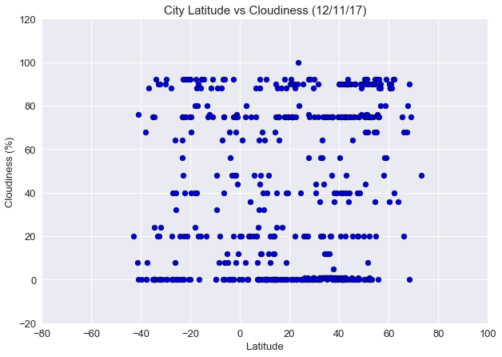
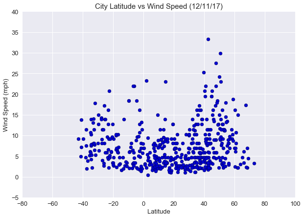

*Analysis*
#1 As expected, the closer you get to the equator, the higher the max daily temperature is in Fahrenheit.  
#2 There does not appear to be much correlation between latitude and cloudiness or latitude and wind speed.
#3 It appears that in latitude vs. humidity, the closer you get to the equator the humidity is higher but there is not a strong correlation here either.
```python
# Dependencies
import pandas as pd
import numpy as np
import requests
import json
import matplotlib.pyplot as plt
import seaborn as sns
import random
from citipy import citipy
import time as time
import unidecode
```


```python
# Grab random cities from CSV
worldcities_pd = pd.read_csv("simple-cities.csv", encoding = 'utf8')

cities = worldcities_pd.sample(n=600)

cities.head()
#random.sample
```


<div>
<style scoped>
    .dataframe tbody tr th:only-of-type {
        vertical-align: middle;
    }

    .dataframe tbody tr th {
        vertical-align: top;
    }

    .dataframe thead th {
        text-align: right;
    }
</style>
<table border="1" class="dataframe">
  <thead>
    <tr style="text-align: right;">
      <th></th>
      <th>city</th>
      <th>city_ascii</th>
      <th>lat</th>
      <th>lng</th>
      <th>pop</th>
      <th>country</th>
      <th>iso2</th>
      <th>iso3</th>
      <th>province</th>
    </tr>
  </thead>
  <tbody>
    <tr>
      <th>1049</th>
      <td>Porto+Nacional</td>
      <td>Porto+Nacional</td>
      <td>-10.700033</td>
      <td>-48.419949</td>
      <td>9129.0</td>
      <td>Brazil</td>
      <td>BR</td>
      <td>BRA</td>
      <td>Tocantins</td>
    </tr>
    <tr>
      <th>5467</th>
      <td>Freetown</td>
      <td>Freetown</td>
      <td>8.470011</td>
      <td>-13.234216</td>
      <td>420384.0</td>
      <td>Sierra+Leone</td>
      <td>SL</td>
      <td>SLE</td>
      <td>Western</td>
    </tr>
    <tr>
      <th>7101</th>
      <td>Paysandu</td>
      <td>Paysandu</td>
      <td>-32.329979</td>
      <td>-58.079980</td>
      <td>76132.5</td>
      <td>Uruguay</td>
      <td>UY</td>
      <td>URY</td>
      <td>Paysandú</td>
    </tr>
    <tr>
      <th>5078</th>
      <td>Kamenna+Obi</td>
      <td>Kamenna+Obi</td>
      <td>53.793602</td>
      <td>81.338797</td>
      <td>40883.0</td>
      <td>Russia</td>
      <td>RU</td>
      <td>RUS</td>
      <td>Altay</td>
    </tr>
    <tr>
      <th>142</th>
      <td>Cangamba</td>
      <td>Cangamba</td>
      <td>-13.699591</td>
      <td>19.860017</td>
      <td>1307.0</td>
      <td>Angola</td>
      <td>AO</td>
      <td>AGO</td>
      <td>Moxico</td>
    </tr>
  </tbody>
</table>
</div>


```python
#Save Parameters for Use
api_key = "5a1900b8b6b43ecdc7d4067c67fe076e"

units = "imperial"

    
```


```python


```


```python
if __name__ == '__main__':
# Create blank columns for necessary fields

    cities_name = []
    cities_cloud = []
    cities_country = []
    cities_date = []
    cities_humid = []
    cities_lat = []
    cities_lon = []
    cities_temp = []
    cities_wind = []
# Counter
    row_count = 0

# Loop through and grab the lat/lng using Google maps
    for index, row in cities.iterrows():
    
    # Create endpoint URL
        url = "http://api.openweathermap.org/data/2.5/weather?&q=" + str(row["city_ascii"]) + "&units=" + units + "&appid=" + api_key
    
    # Print log to ensure loop is working correctly
        print("Now retrieving city # " + str(row_count))
        print(url)
        row_count += 1
    
    # Run requests to grab the JSON at the requested URL
        zip_location = requests.get(url).json()

        time.sleep(1)
    # Append the lat/lng to the appropriate columns
    # Use try / except to skip any cities with errors
        try:
            cities_name.append(zip_location["name"])
            cities_cloud.append(zip_location["clouds"]["all"])
            cities_country.append(zip_location["sys"]["country"])
            cities_date.append(zip_location["dt"])
            cities_humid.append(zip_location["main"]["humidity"])
            cities_lat.append(zip_location["coord"]["lat"])
            cities_lon.append(zip_location["coord"]["lon"])
            cities_temp.append(zip_location["main"]["temp_max"])
            cities_wind.append(zip_location["wind"]["speed"])
    
        except:     
           print("Error with city data. Skipping")
        continue

```

    Now retrieving city # 0
    http://api.openweathermap.org/data/2.5/weather?&q=Islamabad&units=imperial&appid=5a1900b8b6b43ecdc7d4067c67fe076e
    Now retrieving city # 1
    http://api.openweathermap.org/data/2.5/weather?&q=San+Bernardino&units=imperial&appid=5a1900b8b6b43ecdc7d4067c67fe076e
    Now retrieving city # 2
    http://api.openweathermap.org/data/2.5/weather?&q=Olovyannaya&units=imperial&appid=5a1900b8b6b43ecdc7d4067c67fe076e
    Now retrieving city # 3
    http://api.openweathermap.org/data/2.5/weather?&q=Butte&units=imperial&appid=5a1900b8b6b43ecdc7d4067c67fe076e
    Now retrieving city # 4
    http://api.openweathermap.org/data/2.5/weather?&q=Wollongong&units=imperial&appid=5a1900b8b6b43ecdc7d4067c67fe076e
    Now retrieving city # 5
    http://api.openweathermap.org/data/2.5/weather?&q=Dolo+Bay&units=imperial&appid=5a1900b8b6b43ecdc7d4067c67fe076e
    Error with city data. Skipping
    Now retrieving city # 6
    http://api.openweathermap.org/data/2.5/weather?&q=San+Ignacio&units=imperial&appid=5a1900b8b6b43ecdc7d4067c67fe076e
    Now retrieving city # 7
    http://api.openweathermap.org/data/2.5/weather?&q=Pilar&units=imperial&appid=5a1900b8b6b43ecdc7d4067c67fe076e
    Now retrieving city # 8
    http://api.openweathermap.org/data/2.5/weather?&q=New+Taipei&units=imperial&appid=5a1900b8b6b43ecdc7d4067c67fe076e
    Error with city data. Skipping
    Now retrieving city # 9
    http://api.openweathermap.org/data/2.5/weather?&q=Karungu&units=imperial&appid=5a1900b8b6b43ecdc7d4067c67fe076e
    Error with city data. Skipping
    Now retrieving city # 10
    http://api.openweathermap.org/data/2.5/weather?&q=Soro&units=imperial&appid=5a1900b8b6b43ecdc7d4067c67fe076e
    Now retrieving city # 11
    http://api.openweathermap.org/data/2.5/weather?&q=Bethanie&units=imperial&appid=5a1900b8b6b43ecdc7d4067c67fe076e
    Now retrieving city # 12
    http://api.openweathermap.org/data/2.5/weather?&q=Nzeto&units=imperial&appid=5a1900b8b6b43ecdc7d4067c67fe076e
    Now retrieving city # 13
    http://api.openweathermap.org/data/2.5/weather?&q=Dease+Lake&units=imperial&appid=5a1900b8b6b43ecdc7d4067c67fe076e
    Now retrieving city # 14
    http://api.openweathermap.org/data/2.5/weather?&q=Myitkyina&units=imperial&appid=5a1900b8b6b43ecdc7d4067c67fe076e
    Now retrieving city # 15
    http://api.openweathermap.org/data/2.5/weather?&q=Buurhakaba&units=imperial&appid=5a1900b8b6b43ecdc7d4067c67fe076e
    Now retrieving city # 16
    http://api.openweathermap.org/data/2.5/weather?&q=Kasane&units=imperial&appid=5a1900b8b6b43ecdc7d4067c67fe076e
    Now retrieving city # 17
    http://api.openweathermap.org/data/2.5/weather?&q=Collipulli&units=imperial&appid=5a1900b8b6b43ecdc7d4067c67fe076e
    Now retrieving city # 18
    http://api.openweathermap.org/data/2.5/weather?&q=Gwangju&units=imperial&appid=5a1900b8b6b43ecdc7d4067c67fe076e
    Now retrieving city # 19
    http://api.openweathermap.org/data/2.5/weather?&q=Sao+Francisco+do+Sul&units=imperial&appid=5a1900b8b6b43ecdc7d4067c67fe076e
    Now retrieving city # 20
    http://api.openweathermap.org/data/2.5/weather?&q=Coari&units=imperial&appid=5a1900b8b6b43ecdc7d4067c67fe076e
    Now retrieving city # 21
    http://api.openweathermap.org/data/2.5/weather?&q=Thanjavur&units=imperial&appid=5a1900b8b6b43ecdc7d4067c67fe076e
    Now retrieving city # 22
    http://api.openweathermap.org/data/2.5/weather?&q=Huangshi&units=imperial&appid=5a1900b8b6b43ecdc7d4067c67fe076e
    Now retrieving city # 23
    http://api.openweathermap.org/data/2.5/weather?&q=Hamah&units=imperial&appid=5a1900b8b6b43ecdc7d4067c67fe076e
    Now retrieving city # 24
    http://api.openweathermap.org/data/2.5/weather?&q=Scottsdale&units=imperial&appid=5a1900b8b6b43ecdc7d4067c67fe076e
    Now retrieving city # 25
    http://api.openweathermap.org/data/2.5/weather?&q=Haiphong&units=imperial&appid=5a1900b8b6b43ecdc7d4067c67fe076e
    Now retrieving city # 26
    http://api.openweathermap.org/data/2.5/weather?&q=Fasa&units=imperial&appid=5a1900b8b6b43ecdc7d4067c67fe076e
    Now retrieving city # 27
    http://api.openweathermap.org/data/2.5/weather?&q=Palm+Coast&units=imperial&appid=5a1900b8b6b43ecdc7d4067c67fe076e
    Now retrieving city # 28
    http://api.openweathermap.org/data/2.5/weather?&q=Salatiga&units=imperial&appid=5a1900b8b6b43ecdc7d4067c67fe076e
    Now retrieving city # 29
    http://api.openweathermap.org/data/2.5/weather?&q=Capanema&units=imperial&appid=5a1900b8b6b43ecdc7d4067c67fe076e
    Now retrieving city # 30
    http://api.openweathermap.org/data/2.5/weather?&q=La+Paz&units=imperial&appid=5a1900b8b6b43ecdc7d4067c67fe076e
    Now retrieving city # 31
    http://api.openweathermap.org/data/2.5/weather?&q=Klyuchi&units=imperial&appid=5a1900b8b6b43ecdc7d4067c67fe076e
    Now retrieving city # 32
    http://api.openweathermap.org/data/2.5/weather?&q=Yichun&units=imperial&appid=5a1900b8b6b43ecdc7d4067c67fe076e
    Now retrieving city # 33
    http://api.openweathermap.org/data/2.5/weather?&q=Jipijapa&units=imperial&appid=5a1900b8b6b43ecdc7d4067c67fe076e
    Now retrieving city # 34
    http://api.openweathermap.org/data/2.5/weather?&q=Joaquin+V.+Gonzalez&units=imperial&appid=5a1900b8b6b43ecdc7d4067c67fe076e
    Now retrieving city # 35
    http://api.openweathermap.org/data/2.5/weather?&q=Hagere+Hiywet&units=imperial&appid=5a1900b8b6b43ecdc7d4067c67fe076e
    Now retrieving city # 36
    http://api.openweathermap.org/data/2.5/weather?&q=Ceuta&units=imperial&appid=5a1900b8b6b43ecdc7d4067c67fe076e
    Now retrieving city # 37
    http://api.openweathermap.org/data/2.5/weather?&q=Pecos&units=imperial&appid=5a1900b8b6b43ecdc7d4067c67fe076e
    Now retrieving city # 38
    http://api.openweathermap.org/data/2.5/weather?&q=Nyahanga&units=imperial&appid=5a1900b8b6b43ecdc7d4067c67fe076e
    Error with city data. Skipping
    Now retrieving city # 39
    http://api.openweathermap.org/data/2.5/weather?&q=Savonlinna&units=imperial&appid=5a1900b8b6b43ecdc7d4067c67fe076e
    Now retrieving city # 40
    http://api.openweathermap.org/data/2.5/weather?&q=Lafayette&units=imperial&appid=5a1900b8b6b43ecdc7d4067c67fe076e
    Now retrieving city # 41
    http://api.openweathermap.org/data/2.5/weather?&q=Aleg&units=imperial&appid=5a1900b8b6b43ecdc7d4067c67fe076e
    Now retrieving city # 42
    http://api.openweathermap.org/data/2.5/weather?&q=Swift+Current&units=imperial&appid=5a1900b8b6b43ecdc7d4067c67fe076e
    Now retrieving city # 43
    http://api.openweathermap.org/data/2.5/weather?&q=Shepparton&units=imperial&appid=5a1900b8b6b43ecdc7d4067c67fe076e
    Now retrieving city # 44
    http://api.openweathermap.org/data/2.5/weather?&q=Lai&units=imperial&appid=5a1900b8b6b43ecdc7d4067c67fe076e
    Now retrieving city # 45
    http://api.openweathermap.org/data/2.5/weather?&q=Helena&units=imperial&appid=5a1900b8b6b43ecdc7d4067c67fe076e
    Now retrieving city # 46
    http://api.openweathermap.org/data/2.5/weather?&q=Monticello&units=imperial&appid=5a1900b8b6b43ecdc7d4067c67fe076e
    Now retrieving city # 47
    http://api.openweathermap.org/data/2.5/weather?&q=Lgov&units=imperial&appid=5a1900b8b6b43ecdc7d4067c67fe076e
    Error with city data. Skipping
    Now retrieving city # 48
    http://api.openweathermap.org/data/2.5/weather?&q=Moengo&units=imperial&appid=5a1900b8b6b43ecdc7d4067c67fe076e
    Now retrieving city # 49
    http://api.openweathermap.org/data/2.5/weather?&q=Sogamoso&units=imperial&appid=5a1900b8b6b43ecdc7d4067c67fe076e
    Now retrieving city # 50
    http://api.openweathermap.org/data/2.5/weather?&q=Yandoon&units=imperial&appid=5a1900b8b6b43ecdc7d4067c67fe076e
    Error with city data. Skipping
    Now retrieving city # 51
    http://api.openweathermap.org/data/2.5/weather?&q=Po&units=imperial&appid=5a1900b8b6b43ecdc7d4067c67fe076e
    Error with city data. Skipping
    Now retrieving city # 52
    http://api.openweathermap.org/data/2.5/weather?&q=Bentiu&units=imperial&appid=5a1900b8b6b43ecdc7d4067c67fe076e
    Now retrieving city # 53
    http://api.openweathermap.org/data/2.5/weather?&q=Fuerte+Olimpo&units=imperial&appid=5a1900b8b6b43ecdc7d4067c67fe076e
    Now retrieving city # 54
    http://api.openweathermap.org/data/2.5/weather?&q=Nantes&units=imperial&appid=5a1900b8b6b43ecdc7d4067c67fe076e
    Now retrieving city # 55
    http://api.openweathermap.org/data/2.5/weather?&q=Krakow&units=imperial&appid=5a1900b8b6b43ecdc7d4067c67fe076e
    Now retrieving city # 56
    http://api.openweathermap.org/data/2.5/weather?&q=Puerto+Williams&units=imperial&appid=5a1900b8b6b43ecdc7d4067c67fe076e
    Now retrieving city # 57
    http://api.openweathermap.org/data/2.5/weather?&q=Artigas&units=imperial&appid=5a1900b8b6b43ecdc7d4067c67fe076e
    Now retrieving city # 58
    http://api.openweathermap.org/data/2.5/weather?&q=San+Luis&units=imperial&appid=5a1900b8b6b43ecdc7d4067c67fe076e
    Now retrieving city # 59
    http://api.openweathermap.org/data/2.5/weather?&q=Puyang&units=imperial&appid=5a1900b8b6b43ecdc7d4067c67fe076e
    Now retrieving city # 60
    http://api.openweathermap.org/data/2.5/weather?&q=Modesto&units=imperial&appid=5a1900b8b6b43ecdc7d4067c67fe076e
    Now retrieving city # 61
    http://api.openweathermap.org/data/2.5/weather?&q=Beni&units=imperial&appid=5a1900b8b6b43ecdc7d4067c67fe076e
    Now retrieving city # 62
    http://api.openweathermap.org/data/2.5/weather?&q=Tampa&units=imperial&appid=5a1900b8b6b43ecdc7d4067c67fe076e
    Now retrieving city # 63
    http://api.openweathermap.org/data/2.5/weather?&q=Taloyoak&units=imperial&appid=5a1900b8b6b43ecdc7d4067c67fe076e
    Now retrieving city # 64
    http://api.openweathermap.org/data/2.5/weather?&q=Presidente+Dutra&units=imperial&appid=5a1900b8b6b43ecdc7d4067c67fe076e
    Now retrieving city # 65
    http://api.openweathermap.org/data/2.5/weather?&q=Alpena&units=imperial&appid=5a1900b8b6b43ecdc7d4067c67fe076e
    Now retrieving city # 66
    http://api.openweathermap.org/data/2.5/weather?&q=Muglad&units=imperial&appid=5a1900b8b6b43ecdc7d4067c67fe076e
    Error with city data. Skipping
    Now retrieving city # 67
    http://api.openweathermap.org/data/2.5/weather?&q=Tsuruoka&units=imperial&appid=5a1900b8b6b43ecdc7d4067c67fe076e
    Now retrieving city # 68
    http://api.openweathermap.org/data/2.5/weather?&q=Lamar&units=imperial&appid=5a1900b8b6b43ecdc7d4067c67fe076e
    Now retrieving city # 69
    http://api.openweathermap.org/data/2.5/weather?&q=Tongchuan&units=imperial&appid=5a1900b8b6b43ecdc7d4067c67fe076e
    Now retrieving city # 70
    http://api.openweathermap.org/data/2.5/weather?&q=Kem&units=imperial&appid=5a1900b8b6b43ecdc7d4067c67fe076e
    Now retrieving city # 71
    http://api.openweathermap.org/data/2.5/weather?&q=Songea&units=imperial&appid=5a1900b8b6b43ecdc7d4067c67fe076e
    Now retrieving city # 72
    http://api.openweathermap.org/data/2.5/weather?&q=Kimberley&units=imperial&appid=5a1900b8b6b43ecdc7d4067c67fe076e
    Now retrieving city # 73
    http://api.openweathermap.org/data/2.5/weather?&q=Balkanabat&units=imperial&appid=5a1900b8b6b43ecdc7d4067c67fe076e
    Now retrieving city # 74
    http://api.openweathermap.org/data/2.5/weather?&q=Vannersborg&units=imperial&appid=5a1900b8b6b43ecdc7d4067c67fe076e
    Error with city data. Skipping
    Now retrieving city # 75
    http://api.openweathermap.org/data/2.5/weather?&q=Vicente+Guerrero&units=imperial&appid=5a1900b8b6b43ecdc7d4067c67fe076e
    Now retrieving city # 76
    http://api.openweathermap.org/data/2.5/weather?&q=Valle+de+la+Pascua&units=imperial&appid=5a1900b8b6b43ecdc7d4067c67fe076e
    Now retrieving city # 77
    http://api.openweathermap.org/data/2.5/weather?&q=Miass&units=imperial&appid=5a1900b8b6b43ecdc7d4067c67fe076e
    Now retrieving city # 78
    http://api.openweathermap.org/data/2.5/weather?&q=Lutselke&units=imperial&appid=5a1900b8b6b43ecdc7d4067c67fe076e
    Error with city data. Skipping
    Now retrieving city # 79
    http://api.openweathermap.org/data/2.5/weather?&q=Tangier&units=imperial&appid=5a1900b8b6b43ecdc7d4067c67fe076e
    Now retrieving city # 80
    http://api.openweathermap.org/data/2.5/weather?&q=Hlatikulu&units=imperial&appid=5a1900b8b6b43ecdc7d4067c67fe076e
    Now retrieving city # 81
    http://api.openweathermap.org/data/2.5/weather?&q=Caruaru&units=imperial&appid=5a1900b8b6b43ecdc7d4067c67fe076e
    Now retrieving city # 82
    http://api.openweathermap.org/data/2.5/weather?&q=Szeged&units=imperial&appid=5a1900b8b6b43ecdc7d4067c67fe076e
    Now retrieving city # 83
    http://api.openweathermap.org/data/2.5/weather?&q=Santa+Cruz&units=imperial&appid=5a1900b8b6b43ecdc7d4067c67fe076e
    Now retrieving city # 84
    http://api.openweathermap.org/data/2.5/weather?&q=Cirebon&units=imperial&appid=5a1900b8b6b43ecdc7d4067c67fe076e
    Now retrieving city # 85
    http://api.openweathermap.org/data/2.5/weather?&q=Janauba&units=imperial&appid=5a1900b8b6b43ecdc7d4067c67fe076e
    Now retrieving city # 86
    http://api.openweathermap.org/data/2.5/weather?&q=Goundam&units=imperial&appid=5a1900b8b6b43ecdc7d4067c67fe076e
    Now retrieving city # 87
    http://api.openweathermap.org/data/2.5/weather?&q=Kullorsuaq&units=imperial&appid=5a1900b8b6b43ecdc7d4067c67fe076e
    Error with city data. Skipping
    Now retrieving city # 88
    http://api.openweathermap.org/data/2.5/weather?&q=Liuhe&units=imperial&appid=5a1900b8b6b43ecdc7d4067c67fe076e
    Now retrieving city # 89
    http://api.openweathermap.org/data/2.5/weather?&q=Patra&units=imperial&appid=5a1900b8b6b43ecdc7d4067c67fe076e
    Now retrieving city # 90
    http://api.openweathermap.org/data/2.5/weather?&q=Mkokotoni&units=imperial&appid=5a1900b8b6b43ecdc7d4067c67fe076e
    Now retrieving city # 91
    http://api.openweathermap.org/data/2.5/weather?&q=Lamu&units=imperial&appid=5a1900b8b6b43ecdc7d4067c67fe076e
    Now retrieving city # 92
    http://api.openweathermap.org/data/2.5/weather?&q=Shihezi&units=imperial&appid=5a1900b8b6b43ecdc7d4067c67fe076e
    Now retrieving city # 93
    http://api.openweathermap.org/data/2.5/weather?&q=Jeju&units=imperial&appid=5a1900b8b6b43ecdc7d4067c67fe076e
    Now retrieving city # 94
    http://api.openweathermap.org/data/2.5/weather?&q=Madingou&units=imperial&appid=5a1900b8b6b43ecdc7d4067c67fe076e
    Now retrieving city # 95
    http://api.openweathermap.org/data/2.5/weather?&q=Dimitrovgrad&units=imperial&appid=5a1900b8b6b43ecdc7d4067c67fe076e
    Now retrieving city # 96
    http://api.openweathermap.org/data/2.5/weather?&q=Stawell&units=imperial&appid=5a1900b8b6b43ecdc7d4067c67fe076e
    Now retrieving city # 97
    http://api.openweathermap.org/data/2.5/weather?&q=Dinguiraye&units=imperial&appid=5a1900b8b6b43ecdc7d4067c67fe076e
    Now retrieving city # 98
    http://api.openweathermap.org/data/2.5/weather?&q=Frankfort&units=imperial&appid=5a1900b8b6b43ecdc7d4067c67fe076e
    Now retrieving city # 99
    http://api.openweathermap.org/data/2.5/weather?&q=Nain&units=imperial&appid=5a1900b8b6b43ecdc7d4067c67fe076e
    Now retrieving city # 100
    http://api.openweathermap.org/data/2.5/weather?&q=Cornwall&units=imperial&appid=5a1900b8b6b43ecdc7d4067c67fe076e
    Now retrieving city # 101
    http://api.openweathermap.org/data/2.5/weather?&q=Gangtok&units=imperial&appid=5a1900b8b6b43ecdc7d4067c67fe076e
    Now retrieving city # 102
    http://api.openweathermap.org/data/2.5/weather?&q=Lodwar&units=imperial&appid=5a1900b8b6b43ecdc7d4067c67fe076e
    Now retrieving city # 103
    http://api.openweathermap.org/data/2.5/weather?&q=Hamilton&units=imperial&appid=5a1900b8b6b43ecdc7d4067c67fe076e
    Now retrieving city # 104
    http://api.openweathermap.org/data/2.5/weather?&q=Salamanca&units=imperial&appid=5a1900b8b6b43ecdc7d4067c67fe076e
    Now retrieving city # 105
    http://api.openweathermap.org/data/2.5/weather?&q=Itapeva&units=imperial&appid=5a1900b8b6b43ecdc7d4067c67fe076e
    Now retrieving city # 106
    http://api.openweathermap.org/data/2.5/weather?&q=Chachapoyas&units=imperial&appid=5a1900b8b6b43ecdc7d4067c67fe076e
    Now retrieving city # 107
    http://api.openweathermap.org/data/2.5/weather?&q=Chirala&units=imperial&appid=5a1900b8b6b43ecdc7d4067c67fe076e
    Now retrieving city # 108
    http://api.openweathermap.org/data/2.5/weather?&q=Keflavik&units=imperial&appid=5a1900b8b6b43ecdc7d4067c67fe076e
    Now retrieving city # 109
    http://api.openweathermap.org/data/2.5/weather?&q=Lilongwe&units=imperial&appid=5a1900b8b6b43ecdc7d4067c67fe076e
    Now retrieving city # 110
    http://api.openweathermap.org/data/2.5/weather?&q=Richmond&units=imperial&appid=5a1900b8b6b43ecdc7d4067c67fe076e
    Now retrieving city # 111
    http://api.openweathermap.org/data/2.5/weather?&q=Burdur&units=imperial&appid=5a1900b8b6b43ecdc7d4067c67fe076e
    Now retrieving city # 112
    http://api.openweathermap.org/data/2.5/weather?&q=Sheberghan&units=imperial&appid=5a1900b8b6b43ecdc7d4067c67fe076e
    Error with city data. Skipping
    Now retrieving city # 113
    http://api.openweathermap.org/data/2.5/weather?&q=Al+Qamishli&units=imperial&appid=5a1900b8b6b43ecdc7d4067c67fe076e
    Now retrieving city # 114
    http://api.openweathermap.org/data/2.5/weather?&q=Daegu&units=imperial&appid=5a1900b8b6b43ecdc7d4067c67fe076e
    Now retrieving city # 115
    http://api.openweathermap.org/data/2.5/weather?&q=Obluchye&units=imperial&appid=5a1900b8b6b43ecdc7d4067c67fe076e
    Error with city data. Skipping
    Now retrieving city # 116
    http://api.openweathermap.org/data/2.5/weather?&q=Hadiboh&units=imperial&appid=5a1900b8b6b43ecdc7d4067c67fe076e
    Error with city data. Skipping
    Now retrieving city # 117
    http://api.openweathermap.org/data/2.5/weather?&q=Ittoqqortoormiit&units=imperial&appid=5a1900b8b6b43ecdc7d4067c67fe076e
    Now retrieving city # 118
    http://api.openweathermap.org/data/2.5/weather?&q=Lima&units=imperial&appid=5a1900b8b6b43ecdc7d4067c67fe076e
    Now retrieving city # 119
    http://api.openweathermap.org/data/2.5/weather?&q=Suileng&units=imperial&appid=5a1900b8b6b43ecdc7d4067c67fe076e
    Now retrieving city # 120
    http://api.openweathermap.org/data/2.5/weather?&q=Qairouan&units=imperial&appid=5a1900b8b6b43ecdc7d4067c67fe076e
    Error with city data. Skipping
    Now retrieving city # 121
    http://api.openweathermap.org/data/2.5/weather?&q=Mbarara&units=imperial&appid=5a1900b8b6b43ecdc7d4067c67fe076e
    Now retrieving city # 122
    http://api.openweathermap.org/data/2.5/weather?&q=Rimnicu+Vilcea&units=imperial&appid=5a1900b8b6b43ecdc7d4067c67fe076e
    Error with city data. Skipping
    Now retrieving city # 123
    http://api.openweathermap.org/data/2.5/weather?&q=Nacaome&units=imperial&appid=5a1900b8b6b43ecdc7d4067c67fe076e
    Now retrieving city # 124
    http://api.openweathermap.org/data/2.5/weather?&q=Manzanillo&units=imperial&appid=5a1900b8b6b43ecdc7d4067c67fe076e
    Now retrieving city # 125
    http://api.openweathermap.org/data/2.5/weather?&q=Olomouc&units=imperial&appid=5a1900b8b6b43ecdc7d4067c67fe076e
    Now retrieving city # 126
    http://api.openweathermap.org/data/2.5/weather?&q=Finnsnes&units=imperial&appid=5a1900b8b6b43ecdc7d4067c67fe076e
    Now retrieving city # 127
    http://api.openweathermap.org/data/2.5/weather?&q=Caracarai&units=imperial&appid=5a1900b8b6b43ecdc7d4067c67fe076e
    Error with city data. Skipping
    Now retrieving city # 128
    http://api.openweathermap.org/data/2.5/weather?&q=Loncoche&units=imperial&appid=5a1900b8b6b43ecdc7d4067c67fe076e
    Now retrieving city # 129
    http://api.openweathermap.org/data/2.5/weather?&q=Iligan&units=imperial&appid=5a1900b8b6b43ecdc7d4067c67fe076e
    Error with city data. Skipping
    Now retrieving city # 130
    http://api.openweathermap.org/data/2.5/weather?&q=Moyale&units=imperial&appid=5a1900b8b6b43ecdc7d4067c67fe076e
    Now retrieving city # 131
    http://api.openweathermap.org/data/2.5/weather?&q=Bandar-e+Bushehr&units=imperial&appid=5a1900b8b6b43ecdc7d4067c67fe076e
    Error with city data. Skipping
    Now retrieving city # 132
    http://api.openweathermap.org/data/2.5/weather?&q=Keshan&units=imperial&appid=5a1900b8b6b43ecdc7d4067c67fe076e
    Error with city data. Skipping
    Now retrieving city # 133
    http://api.openweathermap.org/data/2.5/weather?&q=Knysna&units=imperial&appid=5a1900b8b6b43ecdc7d4067c67fe076e
    Now retrieving city # 134
    http://api.openweathermap.org/data/2.5/weather?&q=Medemine&units=imperial&appid=5a1900b8b6b43ecdc7d4067c67fe076e
    Error with city data. Skipping
    Now retrieving city # 135
    http://api.openweathermap.org/data/2.5/weather?&q=Nara&units=imperial&appid=5a1900b8b6b43ecdc7d4067c67fe076e
    Error with city data. Skipping
    Now retrieving city # 136
    http://api.openweathermap.org/data/2.5/weather?&q=Linyi&units=imperial&appid=5a1900b8b6b43ecdc7d4067c67fe076e
    Now retrieving city # 137
    http://api.openweathermap.org/data/2.5/weather?&q=Oran&units=imperial&appid=5a1900b8b6b43ecdc7d4067c67fe076e
    Now retrieving city # 138
    http://api.openweathermap.org/data/2.5/weather?&q=Hwange&units=imperial&appid=5a1900b8b6b43ecdc7d4067c67fe076e
    Now retrieving city # 139
    http://api.openweathermap.org/data/2.5/weather?&q=Brunswick&units=imperial&appid=5a1900b8b6b43ecdc7d4067c67fe076e
    Now retrieving city # 140
    http://api.openweathermap.org/data/2.5/weather?&q=Exeter&units=imperial&appid=5a1900b8b6b43ecdc7d4067c67fe076e
    Now retrieving city # 141
    http://api.openweathermap.org/data/2.5/weather?&q=Toumodi&units=imperial&appid=5a1900b8b6b43ecdc7d4067c67fe076e
    Now retrieving city # 142
    http://api.openweathermap.org/data/2.5/weather?&q=Smolensk&units=imperial&appid=5a1900b8b6b43ecdc7d4067c67fe076e
    Now retrieving city # 143
    http://api.openweathermap.org/data/2.5/weather?&q=Nurnberg&units=imperial&appid=5a1900b8b6b43ecdc7d4067c67fe076e
    Error with city data. Skipping
    Now retrieving city # 144
    http://api.openweathermap.org/data/2.5/weather?&q=Ed+Dueim&units=imperial&appid=5a1900b8b6b43ecdc7d4067c67fe076e
    Error with city data. Skipping
    Now retrieving city # 145
    http://api.openweathermap.org/data/2.5/weather?&q=Los+Teques&units=imperial&appid=5a1900b8b6b43ecdc7d4067c67fe076e
    Now retrieving city # 146
    http://api.openweathermap.org/data/2.5/weather?&q=An+Najaf&units=imperial&appid=5a1900b8b6b43ecdc7d4067c67fe076e
    Error with city data. Skipping
    Now retrieving city # 147
    http://api.openweathermap.org/data/2.5/weather?&q=Karaj&units=imperial&appid=5a1900b8b6b43ecdc7d4067c67fe076e
    Now retrieving city # 148
    http://api.openweathermap.org/data/2.5/weather?&q=Zharkent&units=imperial&appid=5a1900b8b6b43ecdc7d4067c67fe076e
    Now retrieving city # 149
    http://api.openweathermap.org/data/2.5/weather?&q=Mandeville&units=imperial&appid=5a1900b8b6b43ecdc7d4067c67fe076e
    Now retrieving city # 150
    http://api.openweathermap.org/data/2.5/weather?&q=Truc+Giang&units=imperial&appid=5a1900b8b6b43ecdc7d4067c67fe076e
    Error with city data. Skipping
    Now retrieving city # 151
    http://api.openweathermap.org/data/2.5/weather?&q=San+Sebastian&units=imperial&appid=5a1900b8b6b43ecdc7d4067c67fe076e
    Now retrieving city # 152
    http://api.openweathermap.org/data/2.5/weather?&q=Toktogul&units=imperial&appid=5a1900b8b6b43ecdc7d4067c67fe076e
    Now retrieving city # 153
    http://api.openweathermap.org/data/2.5/weather?&q=Kulusuk&units=imperial&appid=5a1900b8b6b43ecdc7d4067c67fe076e
    Now retrieving city # 154
    http://api.openweathermap.org/data/2.5/weather?&q=Ponca+City&units=imperial&appid=5a1900b8b6b43ecdc7d4067c67fe076e
    Now retrieving city # 155
    http://api.openweathermap.org/data/2.5/weather?&q=Maracaibo&units=imperial&appid=5a1900b8b6b43ecdc7d4067c67fe076e
    Now retrieving city # 156
    http://api.openweathermap.org/data/2.5/weather?&q=Crestview&units=imperial&appid=5a1900b8b6b43ecdc7d4067c67fe076e
    Now retrieving city # 157
    http://api.openweathermap.org/data/2.5/weather?&q=Qarazhal&units=imperial&appid=5a1900b8b6b43ecdc7d4067c67fe076e
    Now retrieving city # 158
    http://api.openweathermap.org/data/2.5/weather?&q=Biloxi&units=imperial&appid=5a1900b8b6b43ecdc7d4067c67fe076e
    Now retrieving city # 159
    http://api.openweathermap.org/data/2.5/weather?&q=Carnarvon&units=imperial&appid=5a1900b8b6b43ecdc7d4067c67fe076e
    Now retrieving city # 160
    http://api.openweathermap.org/data/2.5/weather?&q=Gumushane&units=imperial&appid=5a1900b8b6b43ecdc7d4067c67fe076e
    Error with city data. Skipping
    Now retrieving city # 161
    http://api.openweathermap.org/data/2.5/weather?&q=Manokwari&units=imperial&appid=5a1900b8b6b43ecdc7d4067c67fe076e
    Now retrieving city # 162
    http://api.openweathermap.org/data/2.5/weather?&q=Rostov&units=imperial&appid=5a1900b8b6b43ecdc7d4067c67fe076e
    Now retrieving city # 163
    http://api.openweathermap.org/data/2.5/weather?&q=Barretos&units=imperial&appid=5a1900b8b6b43ecdc7d4067c67fe076e
    Now retrieving city # 164
    http://api.openweathermap.org/data/2.5/weather?&q=At+Bashy&units=imperial&appid=5a1900b8b6b43ecdc7d4067c67fe076e
    Error with city data. Skipping
    Now retrieving city # 165
    http://api.openweathermap.org/data/2.5/weather?&q=Omboue&units=imperial&appid=5a1900b8b6b43ecdc7d4067c67fe076e
    Now retrieving city # 166
    http://api.openweathermap.org/data/2.5/weather?&q=Taraz&units=imperial&appid=5a1900b8b6b43ecdc7d4067c67fe076e
    Now retrieving city # 167
    http://api.openweathermap.org/data/2.5/weather?&q=Bridgetown&units=imperial&appid=5a1900b8b6b43ecdc7d4067c67fe076e
    Now retrieving city # 168
    http://api.openweathermap.org/data/2.5/weather?&q=Aurangabad&units=imperial&appid=5a1900b8b6b43ecdc7d4067c67fe076e
    Now retrieving city # 169
    http://api.openweathermap.org/data/2.5/weather?&q=Kolpashevo&units=imperial&appid=5a1900b8b6b43ecdc7d4067c67fe076e
    Now retrieving city # 170
    http://api.openweathermap.org/data/2.5/weather?&q=Paragominas&units=imperial&appid=5a1900b8b6b43ecdc7d4067c67fe076e
    Now retrieving city # 171
    http://api.openweathermap.org/data/2.5/weather?&q=Gainesville&units=imperial&appid=5a1900b8b6b43ecdc7d4067c67fe076e
    Now retrieving city # 172
    http://api.openweathermap.org/data/2.5/weather?&q=Zongo&units=imperial&appid=5a1900b8b6b43ecdc7d4067c67fe076e
    Error with city data. Skipping
    Now retrieving city # 173
    http://api.openweathermap.org/data/2.5/weather?&q=Lhokseumawe&units=imperial&appid=5a1900b8b6b43ecdc7d4067c67fe076e
    Now retrieving city # 174
    http://api.openweathermap.org/data/2.5/weather?&q=Dawra&units=imperial&appid=5a1900b8b6b43ecdc7d4067c67fe076e
    Error with city data. Skipping
    Now retrieving city # 175
    http://api.openweathermap.org/data/2.5/weather?&q=Atamyrat&units=imperial&appid=5a1900b8b6b43ecdc7d4067c67fe076e
    Now retrieving city # 176
    http://api.openweathermap.org/data/2.5/weather?&q=Puerto+Deseado&units=imperial&appid=5a1900b8b6b43ecdc7d4067c67fe076e
    Now retrieving city # 177
    http://api.openweathermap.org/data/2.5/weather?&q=Hartford&units=imperial&appid=5a1900b8b6b43ecdc7d4067c67fe076e
    Now retrieving city # 178
    http://api.openweathermap.org/data/2.5/weather?&q=Koszalin&units=imperial&appid=5a1900b8b6b43ecdc7d4067c67fe076e
    Now retrieving city # 179
    http://api.openweathermap.org/data/2.5/weather?&q=Maturin&units=imperial&appid=5a1900b8b6b43ecdc7d4067c67fe076e
    Now retrieving city # 180
    http://api.openweathermap.org/data/2.5/weather?&q=Tierra+Amarilla&units=imperial&appid=5a1900b8b6b43ecdc7d4067c67fe076e
    Now retrieving city # 181
    http://api.openweathermap.org/data/2.5/weather?&q=Zaozernyy&units=imperial&appid=5a1900b8b6b43ecdc7d4067c67fe076e
    Error with city data. Skipping
    Now retrieving city # 182
    http://api.openweathermap.org/data/2.5/weather?&q=Jinotepe&units=imperial&appid=5a1900b8b6b43ecdc7d4067c67fe076e
    Now retrieving city # 183
    http://api.openweathermap.org/data/2.5/weather?&q=Huize&units=imperial&appid=5a1900b8b6b43ecdc7d4067c67fe076e
    Error with city data. Skipping
    Now retrieving city # 184
    http://api.openweathermap.org/data/2.5/weather?&q=Meiganga&units=imperial&appid=5a1900b8b6b43ecdc7d4067c67fe076e
    Now retrieving city # 185
    http://api.openweathermap.org/data/2.5/weather?&q=Camana&units=imperial&appid=5a1900b8b6b43ecdc7d4067c67fe076e
    Now retrieving city # 186
    http://api.openweathermap.org/data/2.5/weather?&q=Mercedes&units=imperial&appid=5a1900b8b6b43ecdc7d4067c67fe076e
    Now retrieving city # 187
    http://api.openweathermap.org/data/2.5/weather?&q=Nakasongola&units=imperial&appid=5a1900b8b6b43ecdc7d4067c67fe076e
    Now retrieving city # 188
    http://api.openweathermap.org/data/2.5/weather?&q=Baglung&units=imperial&appid=5a1900b8b6b43ecdc7d4067c67fe076e
    Now retrieving city # 189
    http://api.openweathermap.org/data/2.5/weather?&q=San+Felipe&units=imperial&appid=5a1900b8b6b43ecdc7d4067c67fe076e
    Now retrieving city # 190
    http://api.openweathermap.org/data/2.5/weather?&q=Al+Mubarraz&units=imperial&appid=5a1900b8b6b43ecdc7d4067c67fe076e
    Now retrieving city # 191
    http://api.openweathermap.org/data/2.5/weather?&q=Skikda&units=imperial&appid=5a1900b8b6b43ecdc7d4067c67fe076e
    Now retrieving city # 192
    http://api.openweathermap.org/data/2.5/weather?&q=Kingston&units=imperial&appid=5a1900b8b6b43ecdc7d4067c67fe076e
    Now retrieving city # 193
    http://api.openweathermap.org/data/2.5/weather?&q=Ouargla&units=imperial&appid=5a1900b8b6b43ecdc7d4067c67fe076e
    Now retrieving city # 194
    http://api.openweathermap.org/data/2.5/weather?&q=Gaza&units=imperial&appid=5a1900b8b6b43ecdc7d4067c67fe076e
    Now retrieving city # 195
    http://api.openweathermap.org/data/2.5/weather?&q=Des+Moines&units=imperial&appid=5a1900b8b6b43ecdc7d4067c67fe076e
    Now retrieving city # 196
    http://api.openweathermap.org/data/2.5/weather?&q=Okhotsk&units=imperial&appid=5a1900b8b6b43ecdc7d4067c67fe076e
    Now retrieving city # 197
    http://api.openweathermap.org/data/2.5/weather?&q=Ust+Kuyga&units=imperial&appid=5a1900b8b6b43ecdc7d4067c67fe076e
    Error with city data. Skipping
    Now retrieving city # 198
    http://api.openweathermap.org/data/2.5/weather?&q=Badulla&units=imperial&appid=5a1900b8b6b43ecdc7d4067c67fe076e
    Now retrieving city # 199
    http://api.openweathermap.org/data/2.5/weather?&q=Vadodara&units=imperial&appid=5a1900b8b6b43ecdc7d4067c67fe076e
    Now retrieving city # 200
    http://api.openweathermap.org/data/2.5/weather?&q=Heidelberg&units=imperial&appid=5a1900b8b6b43ecdc7d4067c67fe076e
    Now retrieving city # 201
    http://api.openweathermap.org/data/2.5/weather?&q=Russas&units=imperial&appid=5a1900b8b6b43ecdc7d4067c67fe076e
    Now retrieving city # 202
    http://api.openweathermap.org/data/2.5/weather?&q=Louga&units=imperial&appid=5a1900b8b6b43ecdc7d4067c67fe076e
    Now retrieving city # 203
    http://api.openweathermap.org/data/2.5/weather?&q=Monte+Plata&units=imperial&appid=5a1900b8b6b43ecdc7d4067c67fe076e
    Now retrieving city # 204
    http://api.openweathermap.org/data/2.5/weather?&q=Ust+Kamchatsk&units=imperial&appid=5a1900b8b6b43ecdc7d4067c67fe076e
    Error with city data. Skipping
    Now retrieving city # 205
    http://api.openweathermap.org/data/2.5/weather?&q=Kamyanets-Podilskyy&units=imperial&appid=5a1900b8b6b43ecdc7d4067c67fe076e
    Error with city data. Skipping
    Now retrieving city # 206
    http://api.openweathermap.org/data/2.5/weather?&q=Erymentau&units=imperial&appid=5a1900b8b6b43ecdc7d4067c67fe076e
    Error with city data. Skipping
    Now retrieving city # 207
    http://api.openweathermap.org/data/2.5/weather?&q=Fort+McMurray&units=imperial&appid=5a1900b8b6b43ecdc7d4067c67fe076e
    Now retrieving city # 208
    http://api.openweathermap.org/data/2.5/weather?&q=Surat+Thani&units=imperial&appid=5a1900b8b6b43ecdc7d4067c67fe076e
    Now retrieving city # 209
    http://api.openweathermap.org/data/2.5/weather?&q=La+Romana&units=imperial&appid=5a1900b8b6b43ecdc7d4067c67fe076e
    Now retrieving city # 210
    http://api.openweathermap.org/data/2.5/weather?&q=Yunxian&units=imperial&appid=5a1900b8b6b43ecdc7d4067c67fe076e
    Error with city data. Skipping
    Now retrieving city # 211
    http://api.openweathermap.org/data/2.5/weather?&q=Chiniot&units=imperial&appid=5a1900b8b6b43ecdc7d4067c67fe076e
    Now retrieving city # 212
    http://api.openweathermap.org/data/2.5/weather?&q=Masaya&units=imperial&appid=5a1900b8b6b43ecdc7d4067c67fe076e
    Now retrieving city # 213
    http://api.openweathermap.org/data/2.5/weather?&q=Concepcion+del+Uruguay&units=imperial&appid=5a1900b8b6b43ecdc7d4067c67fe076e
    Now retrieving city # 214
    http://api.openweathermap.org/data/2.5/weather?&q=Jinhua&units=imperial&appid=5a1900b8b6b43ecdc7d4067c67fe076e
    Now retrieving city # 215
    http://api.openweathermap.org/data/2.5/weather?&q=Faizabad&units=imperial&appid=5a1900b8b6b43ecdc7d4067c67fe076e
    Now retrieving city # 216
    http://api.openweathermap.org/data/2.5/weather?&q=Alausi&units=imperial&appid=5a1900b8b6b43ecdc7d4067c67fe076e
    Now retrieving city # 217
    http://api.openweathermap.org/data/2.5/weather?&q=Agra&units=imperial&appid=5a1900b8b6b43ecdc7d4067c67fe076e
    Now retrieving city # 218
    http://api.openweathermap.org/data/2.5/weather?&q=Ciudad+del+Este&units=imperial&appid=5a1900b8b6b43ecdc7d4067c67fe076e
    Now retrieving city # 219
    http://api.openweathermap.org/data/2.5/weather?&q=Harper&units=imperial&appid=5a1900b8b6b43ecdc7d4067c67fe076e
    Now retrieving city # 220
    http://api.openweathermap.org/data/2.5/weather?&q=Balsas&units=imperial&appid=5a1900b8b6b43ecdc7d4067c67fe076e
    Now retrieving city # 221
    http://api.openweathermap.org/data/2.5/weather?&q=Schwyz&units=imperial&appid=5a1900b8b6b43ecdc7d4067c67fe076e
    Now retrieving city # 222
    http://api.openweathermap.org/data/2.5/weather?&q=Iturama&units=imperial&appid=5a1900b8b6b43ecdc7d4067c67fe076e
    Now retrieving city # 223
    http://api.openweathermap.org/data/2.5/weather?&q=Arusha&units=imperial&appid=5a1900b8b6b43ecdc7d4067c67fe076e
    Now retrieving city # 224
    http://api.openweathermap.org/data/2.5/weather?&q=Pires+do+Rio&units=imperial&appid=5a1900b8b6b43ecdc7d4067c67fe076e
    Now retrieving city # 225
    http://api.openweathermap.org/data/2.5/weather?&q=Bologna&units=imperial&appid=5a1900b8b6b43ecdc7d4067c67fe076e
    Now retrieving city # 226
    http://api.openweathermap.org/data/2.5/weather?&q=Price&units=imperial&appid=5a1900b8b6b43ecdc7d4067c67fe076e
    Now retrieving city # 227
    http://api.openweathermap.org/data/2.5/weather?&q=Pirassununga&units=imperial&appid=5a1900b8b6b43ecdc7d4067c67fe076e
    Now retrieving city # 228
    http://api.openweathermap.org/data/2.5/weather?&q=Saratov&units=imperial&appid=5a1900b8b6b43ecdc7d4067c67fe076e
    Now retrieving city # 229
    http://api.openweathermap.org/data/2.5/weather?&q=Parnu&units=imperial&appid=5a1900b8b6b43ecdc7d4067c67fe076e
    Now retrieving city # 230
    http://api.openweathermap.org/data/2.5/weather?&q=Mandya&units=imperial&appid=5a1900b8b6b43ecdc7d4067c67fe076e
    Now retrieving city # 231
    http://api.openweathermap.org/data/2.5/weather?&q=Lamia&units=imperial&appid=5a1900b8b6b43ecdc7d4067c67fe076e
    Now retrieving city # 232
    http://api.openweathermap.org/data/2.5/weather?&q=Slidell&units=imperial&appid=5a1900b8b6b43ecdc7d4067c67fe076e
    Now retrieving city # 233
    http://api.openweathermap.org/data/2.5/weather?&q=Padang&units=imperial&appid=5a1900b8b6b43ecdc7d4067c67fe076e
    Now retrieving city # 234
    http://api.openweathermap.org/data/2.5/weather?&q=Cluj-Napoca&units=imperial&appid=5a1900b8b6b43ecdc7d4067c67fe076e
    Now retrieving city # 235
    http://api.openweathermap.org/data/2.5/weather?&q=Woomera&units=imperial&appid=5a1900b8b6b43ecdc7d4067c67fe076e
    Now retrieving city # 236
    http://api.openweathermap.org/data/2.5/weather?&q=Kovel&units=imperial&appid=5a1900b8b6b43ecdc7d4067c67fe076e
    Now retrieving city # 237
    http://api.openweathermap.org/data/2.5/weather?&q=Yarumal&units=imperial&appid=5a1900b8b6b43ecdc7d4067c67fe076e
    Now retrieving city # 238
    http://api.openweathermap.org/data/2.5/weather?&q=Necochea&units=imperial&appid=5a1900b8b6b43ecdc7d4067c67fe076e
    Now retrieving city # 239
    http://api.openweathermap.org/data/2.5/weather?&q=Uvinza&units=imperial&appid=5a1900b8b6b43ecdc7d4067c67fe076e
    Now retrieving city # 240
    http://api.openweathermap.org/data/2.5/weather?&q=Al-Qatif&units=imperial&appid=5a1900b8b6b43ecdc7d4067c67fe076e
    Error with city data. Skipping
    Now retrieving city # 241
    http://api.openweathermap.org/data/2.5/weather?&q=Bryansk&units=imperial&appid=5a1900b8b6b43ecdc7d4067c67fe076e
    Now retrieving city # 242
    http://api.openweathermap.org/data/2.5/weather?&q=Guliston&units=imperial&appid=5a1900b8b6b43ecdc7d4067c67fe076e
    Now retrieving city # 243
    http://api.openweathermap.org/data/2.5/weather?&q=Tasikmalaya&units=imperial&appid=5a1900b8b6b43ecdc7d4067c67fe076e
    Now retrieving city # 244
    http://api.openweathermap.org/data/2.5/weather?&q=Yasothon&units=imperial&appid=5a1900b8b6b43ecdc7d4067c67fe076e
    Now retrieving city # 245
    http://api.openweathermap.org/data/2.5/weather?&q=Nueva+San+Salvador&units=imperial&appid=5a1900b8b6b43ecdc7d4067c67fe076e
    Error with city data. Skipping
    Now retrieving city # 246
    http://api.openweathermap.org/data/2.5/weather?&q=Cherskiy&units=imperial&appid=5a1900b8b6b43ecdc7d4067c67fe076e
    Now retrieving city # 247
    http://api.openweathermap.org/data/2.5/weather?&q=Ahvaz&units=imperial&appid=5a1900b8b6b43ecdc7d4067c67fe076e
    Now retrieving city # 248
    http://api.openweathermap.org/data/2.5/weather?&q=Fort+Stockton&units=imperial&appid=5a1900b8b6b43ecdc7d4067c67fe076e
    Now retrieving city # 249
    http://api.openweathermap.org/data/2.5/weather?&q=Kulob&units=imperial&appid=5a1900b8b6b43ecdc7d4067c67fe076e
    Now retrieving city # 250
    http://api.openweathermap.org/data/2.5/weather?&q=Wroclaw&units=imperial&appid=5a1900b8b6b43ecdc7d4067c67fe076e
    Now retrieving city # 251
    http://api.openweathermap.org/data/2.5/weather?&q=Goiania&units=imperial&appid=5a1900b8b6b43ecdc7d4067c67fe076e
    Now retrieving city # 252
    http://api.openweathermap.org/data/2.5/weather?&q=Yen+Bai&units=imperial&appid=5a1900b8b6b43ecdc7d4067c67fe076e
    Now retrieving city # 253
    http://api.openweathermap.org/data/2.5/weather?&q=Vitsyebsk&units=imperial&appid=5a1900b8b6b43ecdc7d4067c67fe076e
    Now retrieving city # 254
    http://api.openweathermap.org/data/2.5/weather?&q=Siteki&units=imperial&appid=5a1900b8b6b43ecdc7d4067c67fe076e
    Now retrieving city # 255
    http://api.openweathermap.org/data/2.5/weather?&q=Shahjahanpur&units=imperial&appid=5a1900b8b6b43ecdc7d4067c67fe076e
    Now retrieving city # 256
    http://api.openweathermap.org/data/2.5/weather?&q=Francistown&units=imperial&appid=5a1900b8b6b43ecdc7d4067c67fe076e
    Now retrieving city # 257
    http://api.openweathermap.org/data/2.5/weather?&q=Pleven&units=imperial&appid=5a1900b8b6b43ecdc7d4067c67fe076e
    Now retrieving city # 258
    http://api.openweathermap.org/data/2.5/weather?&q=Eagle+Pass&units=imperial&appid=5a1900b8b6b43ecdc7d4067c67fe076e
    Now retrieving city # 259
    http://api.openweathermap.org/data/2.5/weather?&q=Tovuz&units=imperial&appid=5a1900b8b6b43ecdc7d4067c67fe076e
    Now retrieving city # 260
    http://api.openweathermap.org/data/2.5/weather?&q=Karonga&units=imperial&appid=5a1900b8b6b43ecdc7d4067c67fe076e
    Now retrieving city # 261
    http://api.openweathermap.org/data/2.5/weather?&q=Jacksonville&units=imperial&appid=5a1900b8b6b43ecdc7d4067c67fe076e
    Now retrieving city # 262
    http://api.openweathermap.org/data/2.5/weather?&q=Novorossiysk&units=imperial&appid=5a1900b8b6b43ecdc7d4067c67fe076e
    Now retrieving city # 263
    http://api.openweathermap.org/data/2.5/weather?&q=Crateus&units=imperial&appid=5a1900b8b6b43ecdc7d4067c67fe076e
    Now retrieving city # 264
    http://api.openweathermap.org/data/2.5/weather?&q=Los+Angeles&units=imperial&appid=5a1900b8b6b43ecdc7d4067c67fe076e
    Now retrieving city # 265
    http://api.openweathermap.org/data/2.5/weather?&q=Guangzhou&units=imperial&appid=5a1900b8b6b43ecdc7d4067c67fe076e
    Now retrieving city # 266
    http://api.openweathermap.org/data/2.5/weather?&q=Cadiz&units=imperial&appid=5a1900b8b6b43ecdc7d4067c67fe076e
    Now retrieving city # 267
    http://api.openweathermap.org/data/2.5/weather?&q=Kecskemet&units=imperial&appid=5a1900b8b6b43ecdc7d4067c67fe076e
    Now retrieving city # 268
    http://api.openweathermap.org/data/2.5/weather?&q=Pol-e+Khomri&units=imperial&appid=5a1900b8b6b43ecdc7d4067c67fe076e
    Error with city data. Skipping
    Now retrieving city # 269
    http://api.openweathermap.org/data/2.5/weather?&q=Calatrava&units=imperial&appid=5a1900b8b6b43ecdc7d4067c67fe076e
    Now retrieving city # 270
    http://api.openweathermap.org/data/2.5/weather?&q=Alekseyevka&units=imperial&appid=5a1900b8b6b43ecdc7d4067c67fe076e
    Now retrieving city # 271
    http://api.openweathermap.org/data/2.5/weather?&q=Bilibino&units=imperial&appid=5a1900b8b6b43ecdc7d4067c67fe076e
    Now retrieving city # 272
    http://api.openweathermap.org/data/2.5/weather?&q=Biratnagar&units=imperial&appid=5a1900b8b6b43ecdc7d4067c67fe076e
    Now retrieving city # 273
    http://api.openweathermap.org/data/2.5/weather?&q=Savannakhet&units=imperial&appid=5a1900b8b6b43ecdc7d4067c67fe076e
    Now retrieving city # 274
    http://api.openweathermap.org/data/2.5/weather?&q=Metz&units=imperial&appid=5a1900b8b6b43ecdc7d4067c67fe076e
    Now retrieving city # 275
    http://api.openweathermap.org/data/2.5/weather?&q=Rundu&units=imperial&appid=5a1900b8b6b43ecdc7d4067c67fe076e
    Now retrieving city # 276
    http://api.openweathermap.org/data/2.5/weather?&q=Hachinohe&units=imperial&appid=5a1900b8b6b43ecdc7d4067c67fe076e
    Now retrieving city # 277
    http://api.openweathermap.org/data/2.5/weather?&q=Karur&units=imperial&appid=5a1900b8b6b43ecdc7d4067c67fe076e
    Now retrieving city # 278
    http://api.openweathermap.org/data/2.5/weather?&q=Uruara&units=imperial&appid=5a1900b8b6b43ecdc7d4067c67fe076e
    Error with city data. Skipping
    Now retrieving city # 279
    http://api.openweathermap.org/data/2.5/weather?&q=Salto&units=imperial&appid=5a1900b8b6b43ecdc7d4067c67fe076e
    Now retrieving city # 280
    http://api.openweathermap.org/data/2.5/weather?&q=Tagum&units=imperial&appid=5a1900b8b6b43ecdc7d4067c67fe076e
    Now retrieving city # 281
    http://api.openweathermap.org/data/2.5/weather?&q=Socorro&units=imperial&appid=5a1900b8b6b43ecdc7d4067c67fe076e
    Now retrieving city # 282
    http://api.openweathermap.org/data/2.5/weather?&q=Holguin&units=imperial&appid=5a1900b8b6b43ecdc7d4067c67fe076e
    Now retrieving city # 283
    http://api.openweathermap.org/data/2.5/weather?&q=Hay+River&units=imperial&appid=5a1900b8b6b43ecdc7d4067c67fe076e
    Now retrieving city # 284
    http://api.openweathermap.org/data/2.5/weather?&q=Pingxiang&units=imperial&appid=5a1900b8b6b43ecdc7d4067c67fe076e
    Now retrieving city # 285
    http://api.openweathermap.org/data/2.5/weather?&q=Ho+Chi+Minh+City&units=imperial&appid=5a1900b8b6b43ecdc7d4067c67fe076e
    Error with city data. Skipping
    Now retrieving city # 286
    http://api.openweathermap.org/data/2.5/weather?&q=Buea&units=imperial&appid=5a1900b8b6b43ecdc7d4067c67fe076e
    Now retrieving city # 287
    http://api.openweathermap.org/data/2.5/weather?&q=Tupa&units=imperial&appid=5a1900b8b6b43ecdc7d4067c67fe076e
    Now retrieving city # 288
    http://api.openweathermap.org/data/2.5/weather?&q=Sittwe&units=imperial&appid=5a1900b8b6b43ecdc7d4067c67fe076e
    Now retrieving city # 289
    http://api.openweathermap.org/data/2.5/weather?&q=Urgentch&units=imperial&appid=5a1900b8b6b43ecdc7d4067c67fe076e
    Error with city data. Skipping
    Now retrieving city # 290
    http://api.openweathermap.org/data/2.5/weather?&q=Ash+Shatrah&units=imperial&appid=5a1900b8b6b43ecdc7d4067c67fe076e
    Now retrieving city # 291
    http://api.openweathermap.org/data/2.5/weather?&q=Kaduna&units=imperial&appid=5a1900b8b6b43ecdc7d4067c67fe076e
    Now retrieving city # 292
    http://api.openweathermap.org/data/2.5/weather?&q=Brumado&units=imperial&appid=5a1900b8b6b43ecdc7d4067c67fe076e
    Now retrieving city # 293
    http://api.openweathermap.org/data/2.5/weather?&q=Lamas&units=imperial&appid=5a1900b8b6b43ecdc7d4067c67fe076e
    Now retrieving city # 294
    http://api.openweathermap.org/data/2.5/weather?&q=Zheleznogorsk&units=imperial&appid=5a1900b8b6b43ecdc7d4067c67fe076e
    Now retrieving city # 295
    http://api.openweathermap.org/data/2.5/weather?&q=Columbus&units=imperial&appid=5a1900b8b6b43ecdc7d4067c67fe076e
    Now retrieving city # 296
    http://api.openweathermap.org/data/2.5/weather?&q=Mirzapur&units=imperial&appid=5a1900b8b6b43ecdc7d4067c67fe076e
    Now retrieving city # 297
    http://api.openweathermap.org/data/2.5/weather?&q=Riverside&units=imperial&appid=5a1900b8b6b43ecdc7d4067c67fe076e
    Now retrieving city # 298
    http://api.openweathermap.org/data/2.5/weather?&q=Fulin&units=imperial&appid=5a1900b8b6b43ecdc7d4067c67fe076e
    Error with city data. Skipping
    Now retrieving city # 299
    http://api.openweathermap.org/data/2.5/weather?&q=Bukavu&units=imperial&appid=5a1900b8b6b43ecdc7d4067c67fe076e
    Now retrieving city # 300
    http://api.openweathermap.org/data/2.5/weather?&q=Ciudad+Victoria&units=imperial&appid=5a1900b8b6b43ecdc7d4067c67fe076e
    Now retrieving city # 301
    http://api.openweathermap.org/data/2.5/weather?&q=Warri&units=imperial&appid=5a1900b8b6b43ecdc7d4067c67fe076e
    Now retrieving city # 302
    http://api.openweathermap.org/data/2.5/weather?&q=Sarapul&units=imperial&appid=5a1900b8b6b43ecdc7d4067c67fe076e
    Now retrieving city # 303
    http://api.openweathermap.org/data/2.5/weather?&q=Joplin&units=imperial&appid=5a1900b8b6b43ecdc7d4067c67fe076e
    Now retrieving city # 304
    http://api.openweathermap.org/data/2.5/weather?&q=Pyay&units=imperial&appid=5a1900b8b6b43ecdc7d4067c67fe076e
    Now retrieving city # 305
    http://api.openweathermap.org/data/2.5/weather?&q=Tinogasta&units=imperial&appid=5a1900b8b6b43ecdc7d4067c67fe076e
    Now retrieving city # 306
    http://api.openweathermap.org/data/2.5/weather?&q=Quinhagak&units=imperial&appid=5a1900b8b6b43ecdc7d4067c67fe076e
    Error with city data. Skipping
    Now retrieving city # 307
    http://api.openweathermap.org/data/2.5/weather?&q=Raleigh&units=imperial&appid=5a1900b8b6b43ecdc7d4067c67fe076e
    Now retrieving city # 308
    http://api.openweathermap.org/data/2.5/weather?&q=Hulan+Ergi&units=imperial&appid=5a1900b8b6b43ecdc7d4067c67fe076e
    Now retrieving city # 309
    http://api.openweathermap.org/data/2.5/weather?&q=Nandyal&units=imperial&appid=5a1900b8b6b43ecdc7d4067c67fe076e
    Now retrieving city # 310
    http://api.openweathermap.org/data/2.5/weather?&q=Nzerekore&units=imperial&appid=5a1900b8b6b43ecdc7d4067c67fe076e
    Now retrieving city # 311
    http://api.openweathermap.org/data/2.5/weather?&q=Balykchy&units=imperial&appid=5a1900b8b6b43ecdc7d4067c67fe076e
    Now retrieving city # 312
    http://api.openweathermap.org/data/2.5/weather?&q=Malayer&units=imperial&appid=5a1900b8b6b43ecdc7d4067c67fe076e
    Now retrieving city # 313
    http://api.openweathermap.org/data/2.5/weather?&q=Ajdabiya&units=imperial&appid=5a1900b8b6b43ecdc7d4067c67fe076e
    Now retrieving city # 314
    http://api.openweathermap.org/data/2.5/weather?&q=Koutiala&units=imperial&appid=5a1900b8b6b43ecdc7d4067c67fe076e
    Now retrieving city # 315
    http://api.openweathermap.org/data/2.5/weather?&q=Tolyatti&units=imperial&appid=5a1900b8b6b43ecdc7d4067c67fe076e
    Now retrieving city # 316
    http://api.openweathermap.org/data/2.5/weather?&q=Gualeguaychu&units=imperial&appid=5a1900b8b6b43ecdc7d4067c67fe076e
    Now retrieving city # 317
    http://api.openweathermap.org/data/2.5/weather?&q=Asino&units=imperial&appid=5a1900b8b6b43ecdc7d4067c67fe076e
    Now retrieving city # 318
    http://api.openweathermap.org/data/2.5/weather?&q=Arvayheer&units=imperial&appid=5a1900b8b6b43ecdc7d4067c67fe076e
    Now retrieving city # 319
    http://api.openweathermap.org/data/2.5/weather?&q=Cochrane&units=imperial&appid=5a1900b8b6b43ecdc7d4067c67fe076e
    Now retrieving city # 320
    http://api.openweathermap.org/data/2.5/weather?&q=Kotlas&units=imperial&appid=5a1900b8b6b43ecdc7d4067c67fe076e
    Now retrieving city # 321
    http://api.openweathermap.org/data/2.5/weather?&q=Trujillo&units=imperial&appid=5a1900b8b6b43ecdc7d4067c67fe076e
    Now retrieving city # 322
    http://api.openweathermap.org/data/2.5/weather?&q=Polatli&units=imperial&appid=5a1900b8b6b43ecdc7d4067c67fe076e
    Now retrieving city # 323
    http://api.openweathermap.org/data/2.5/weather?&q=Sanniquellie&units=imperial&appid=5a1900b8b6b43ecdc7d4067c67fe076e
    Now retrieving city # 324
    http://api.openweathermap.org/data/2.5/weather?&q=Aniak&units=imperial&appid=5a1900b8b6b43ecdc7d4067c67fe076e
    Error with city data. Skipping
    Now retrieving city # 325
    http://api.openweathermap.org/data/2.5/weather?&q=El+Jadida&units=imperial&appid=5a1900b8b6b43ecdc7d4067c67fe076e
    Now retrieving city # 326
    http://api.openweathermap.org/data/2.5/weather?&q=Popayan&units=imperial&appid=5a1900b8b6b43ecdc7d4067c67fe076e
    Now retrieving city # 327
    http://api.openweathermap.org/data/2.5/weather?&q=Basankusu&units=imperial&appid=5a1900b8b6b43ecdc7d4067c67fe076e
    Now retrieving city # 328
    http://api.openweathermap.org/data/2.5/weather?&q=Bukhara&units=imperial&appid=5a1900b8b6b43ecdc7d4067c67fe076e
    Error with city data. Skipping
    Now retrieving city # 329
    http://api.openweathermap.org/data/2.5/weather?&q=Nebbi&units=imperial&appid=5a1900b8b6b43ecdc7d4067c67fe076e
    Now retrieving city # 330
    http://api.openweathermap.org/data/2.5/weather?&q=Tikhoretsk&units=imperial&appid=5a1900b8b6b43ecdc7d4067c67fe076e
    Now retrieving city # 331
    http://api.openweathermap.org/data/2.5/weather?&q=Qasserine&units=imperial&appid=5a1900b8b6b43ecdc7d4067c67fe076e
    Error with city data. Skipping
    Now retrieving city # 332
    http://api.openweathermap.org/data/2.5/weather?&q=Nelspruit&units=imperial&appid=5a1900b8b6b43ecdc7d4067c67fe076e
    Now retrieving city # 333
    http://api.openweathermap.org/data/2.5/weather?&q=Pakhachi&units=imperial&appid=5a1900b8b6b43ecdc7d4067c67fe076e
    Error with city data. Skipping
    Now retrieving city # 334
    http://api.openweathermap.org/data/2.5/weather?&q=Cuangar&units=imperial&appid=5a1900b8b6b43ecdc7d4067c67fe076e
    Error with city data. Skipping
    Now retrieving city # 335
    http://api.openweathermap.org/data/2.5/weather?&q=Trois+Rivieres&units=imperial&appid=5a1900b8b6b43ecdc7d4067c67fe076e
    Error with city data. Skipping
    Now retrieving city # 336
    http://api.openweathermap.org/data/2.5/weather?&q=Ongole&units=imperial&appid=5a1900b8b6b43ecdc7d4067c67fe076e
    Now retrieving city # 337
    http://api.openweathermap.org/data/2.5/weather?&q=Indianapolis&units=imperial&appid=5a1900b8b6b43ecdc7d4067c67fe076e
    Now retrieving city # 338
    http://api.openweathermap.org/data/2.5/weather?&q=Escuintla&units=imperial&appid=5a1900b8b6b43ecdc7d4067c67fe076e
    Now retrieving city # 339
    http://api.openweathermap.org/data/2.5/weather?&q=Jakarta&units=imperial&appid=5a1900b8b6b43ecdc7d4067c67fe076e
    Now retrieving city # 340
    http://api.openweathermap.org/data/2.5/weather?&q=Perm&units=imperial&appid=5a1900b8b6b43ecdc7d4067c67fe076e
    Now retrieving city # 341
    http://api.openweathermap.org/data/2.5/weather?&q=Granja&units=imperial&appid=5a1900b8b6b43ecdc7d4067c67fe076e
    Now retrieving city # 342
    http://api.openweathermap.org/data/2.5/weather?&q=Ponta+Grossa&units=imperial&appid=5a1900b8b6b43ecdc7d4067c67fe076e
    Now retrieving city # 343
    http://api.openweathermap.org/data/2.5/weather?&q=Orongen+Zizhiqi&units=imperial&appid=5a1900b8b6b43ecdc7d4067c67fe076e
    Error with city data. Skipping
    Now retrieving city # 344
    http://api.openweathermap.org/data/2.5/weather?&q=Cafayate&units=imperial&appid=5a1900b8b6b43ecdc7d4067c67fe076e
    Now retrieving city # 345
    http://api.openweathermap.org/data/2.5/weather?&q=Niteroi&units=imperial&appid=5a1900b8b6b43ecdc7d4067c67fe076e
    Now retrieving city # 346
    http://api.openweathermap.org/data/2.5/weather?&q=Fort+St.+John&units=imperial&appid=5a1900b8b6b43ecdc7d4067c67fe076e
    Now retrieving city # 347
    http://api.openweathermap.org/data/2.5/weather?&q=Dumfries&units=imperial&appid=5a1900b8b6b43ecdc7d4067c67fe076e
    Now retrieving city # 348
    http://api.openweathermap.org/data/2.5/weather?&q=Greenville&units=imperial&appid=5a1900b8b6b43ecdc7d4067c67fe076e
    Now retrieving city # 349
    http://api.openweathermap.org/data/2.5/weather?&q=Joao+Pessoa&units=imperial&appid=5a1900b8b6b43ecdc7d4067c67fe076e
    Now retrieving city # 350
    http://api.openweathermap.org/data/2.5/weather?&q=Mbala&units=imperial&appid=5a1900b8b6b43ecdc7d4067c67fe076e
    Now retrieving city # 351
    http://api.openweathermap.org/data/2.5/weather?&q=Polygyros&units=imperial&appid=5a1900b8b6b43ecdc7d4067c67fe076e
    Now retrieving city # 352
    http://api.openweathermap.org/data/2.5/weather?&q=San+Salvador+de+Jujuy&units=imperial&appid=5a1900b8b6b43ecdc7d4067c67fe076e
    Now retrieving city # 353
    http://api.openweathermap.org/data/2.5/weather?&q=Tuticorin&units=imperial&appid=5a1900b8b6b43ecdc7d4067c67fe076e
    Error with city data. Skipping
    Now retrieving city # 354
    http://api.openweathermap.org/data/2.5/weather?&q=Gikongoro&units=imperial&appid=5a1900b8b6b43ecdc7d4067c67fe076e
    Now retrieving city # 355
    http://api.openweathermap.org/data/2.5/weather?&q=Bulaevo&units=imperial&appid=5a1900b8b6b43ecdc7d4067c67fe076e
    Now retrieving city # 356
    http://api.openweathermap.org/data/2.5/weather?&q=Linjiang&units=imperial&appid=5a1900b8b6b43ecdc7d4067c67fe076e
    Now retrieving city # 357
    http://api.openweathermap.org/data/2.5/weather?&q=Denton&units=imperial&appid=5a1900b8b6b43ecdc7d4067c67fe076e
    Now retrieving city # 358
    http://api.openweathermap.org/data/2.5/weather?&q=Rio+Negro&units=imperial&appid=5a1900b8b6b43ecdc7d4067c67fe076e
    Now retrieving city # 359
    http://api.openweathermap.org/data/2.5/weather?&q=Georgetown&units=imperial&appid=5a1900b8b6b43ecdc7d4067c67fe076e
    Now retrieving city # 360
    http://api.openweathermap.org/data/2.5/weather?&q=Key+West&units=imperial&appid=5a1900b8b6b43ecdc7d4067c67fe076e
    Now retrieving city # 361
    http://api.openweathermap.org/data/2.5/weather?&q=Xuanhua&units=imperial&appid=5a1900b8b6b43ecdc7d4067c67fe076e
    Now retrieving city # 362
    http://api.openweathermap.org/data/2.5/weather?&q=Sechura&units=imperial&appid=5a1900b8b6b43ecdc7d4067c67fe076e
    Now retrieving city # 363
    http://api.openweathermap.org/data/2.5/weather?&q=Maiduguri&units=imperial&appid=5a1900b8b6b43ecdc7d4067c67fe076e
    Now retrieving city # 364
    http://api.openweathermap.org/data/2.5/weather?&q=Penedo&units=imperial&appid=5a1900b8b6b43ecdc7d4067c67fe076e
    Now retrieving city # 365
    http://api.openweathermap.org/data/2.5/weather?&q=Richmond&units=imperial&appid=5a1900b8b6b43ecdc7d4067c67fe076e
    Now retrieving city # 366
    http://api.openweathermap.org/data/2.5/weather?&q=Korf&units=imperial&appid=5a1900b8b6b43ecdc7d4067c67fe076e
    Error with city data. Skipping
    Now retrieving city # 367
    http://api.openweathermap.org/data/2.5/weather?&q=Ruyigi&units=imperial&appid=5a1900b8b6b43ecdc7d4067c67fe076e
    Now retrieving city # 368
    http://api.openweathermap.org/data/2.5/weather?&q=Chitungwiza&units=imperial&appid=5a1900b8b6b43ecdc7d4067c67fe076e
    Now retrieving city # 369
    http://api.openweathermap.org/data/2.5/weather?&q=Mweka&units=imperial&appid=5a1900b8b6b43ecdc7d4067c67fe076e
    Now retrieving city # 370
    http://api.openweathermap.org/data/2.5/weather?&q=Shimanovsk&units=imperial&appid=5a1900b8b6b43ecdc7d4067c67fe076e
    Now retrieving city # 371
    http://api.openweathermap.org/data/2.5/weather?&q=Marzuq&units=imperial&appid=5a1900b8b6b43ecdc7d4067c67fe076e
    Error with city data. Skipping
    Now retrieving city # 372
    http://api.openweathermap.org/data/2.5/weather?&q=Osakarovka&units=imperial&appid=5a1900b8b6b43ecdc7d4067c67fe076e
    Now retrieving city # 373
    http://api.openweathermap.org/data/2.5/weather?&q=Harrisonburg&units=imperial&appid=5a1900b8b6b43ecdc7d4067c67fe076e
    Now retrieving city # 374
    http://api.openweathermap.org/data/2.5/weather?&q=Otar&units=imperial&appid=5a1900b8b6b43ecdc7d4067c67fe076e
    Error with city data. Skipping
    Now retrieving city # 375
    http://api.openweathermap.org/data/2.5/weather?&q=Queretaro&units=imperial&appid=5a1900b8b6b43ecdc7d4067c67fe076e
    Error with city data. Skipping
    Now retrieving city # 376
    http://api.openweathermap.org/data/2.5/weather?&q=Goure&units=imperial&appid=5a1900b8b6b43ecdc7d4067c67fe076e
    Now retrieving city # 377
    http://api.openweathermap.org/data/2.5/weather?&q=Paracuru&units=imperial&appid=5a1900b8b6b43ecdc7d4067c67fe076e
    Now retrieving city # 378
    http://api.openweathermap.org/data/2.5/weather?&q=Coimbatore&units=imperial&appid=5a1900b8b6b43ecdc7d4067c67fe076e
    Now retrieving city # 379
    http://api.openweathermap.org/data/2.5/weather?&q=Lander&units=imperial&appid=5a1900b8b6b43ecdc7d4067c67fe076e
    Now retrieving city # 380
    http://api.openweathermap.org/data/2.5/weather?&q=San+Pedro&units=imperial&appid=5a1900b8b6b43ecdc7d4067c67fe076e
    Now retrieving city # 381
    http://api.openweathermap.org/data/2.5/weather?&q=Sukabumi&units=imperial&appid=5a1900b8b6b43ecdc7d4067c67fe076e
    Now retrieving city # 382
    http://api.openweathermap.org/data/2.5/weather?&q=Ariquemes&units=imperial&appid=5a1900b8b6b43ecdc7d4067c67fe076e
    Now retrieving city # 383
    http://api.openweathermap.org/data/2.5/weather?&q=Jhansi&units=imperial&appid=5a1900b8b6b43ecdc7d4067c67fe076e
    Now retrieving city # 384
    http://api.openweathermap.org/data/2.5/weather?&q=Wewak&units=imperial&appid=5a1900b8b6b43ecdc7d4067c67fe076e
    Now retrieving city # 385
    http://api.openweathermap.org/data/2.5/weather?&q=Neuchatel&units=imperial&appid=5a1900b8b6b43ecdc7d4067c67fe076e
    Now retrieving city # 386
    http://api.openweathermap.org/data/2.5/weather?&q=General+Conesa&units=imperial&appid=5a1900b8b6b43ecdc7d4067c67fe076e
    Now retrieving city # 387
    http://api.openweathermap.org/data/2.5/weather?&q=Shah+Alam&units=imperial&appid=5a1900b8b6b43ecdc7d4067c67fe076e
    Now retrieving city # 388
    http://api.openweathermap.org/data/2.5/weather?&q=Taganrog&units=imperial&appid=5a1900b8b6b43ecdc7d4067c67fe076e
    Now retrieving city # 389
    http://api.openweathermap.org/data/2.5/weather?&q=Tolu&units=imperial&appid=5a1900b8b6b43ecdc7d4067c67fe076e
    Now retrieving city # 390
    http://api.openweathermap.org/data/2.5/weather?&q=Monrovia&units=imperial&appid=5a1900b8b6b43ecdc7d4067c67fe076e
    Now retrieving city # 391
    http://api.openweathermap.org/data/2.5/weather?&q=Yuxi&units=imperial&appid=5a1900b8b6b43ecdc7d4067c67fe076e
    Now retrieving city # 392
    http://api.openweathermap.org/data/2.5/weather?&q=Cutral+Co&units=imperial&appid=5a1900b8b6b43ecdc7d4067c67fe076e
    Error with city data. Skipping
    Now retrieving city # 393
    http://api.openweathermap.org/data/2.5/weather?&q=Kiama&units=imperial&appid=5a1900b8b6b43ecdc7d4067c67fe076e
    Now retrieving city # 394
    http://api.openweathermap.org/data/2.5/weather?&q=Surabaya&units=imperial&appid=5a1900b8b6b43ecdc7d4067c67fe076e
    Now retrieving city # 395
    http://api.openweathermap.org/data/2.5/weather?&q=Verkhoyansk&units=imperial&appid=5a1900b8b6b43ecdc7d4067c67fe076e
    Now retrieving city # 396
    http://api.openweathermap.org/data/2.5/weather?&q=May+Pen&units=imperial&appid=5a1900b8b6b43ecdc7d4067c67fe076e
    Now retrieving city # 397
    http://api.openweathermap.org/data/2.5/weather?&q=Santa+Maria&units=imperial&appid=5a1900b8b6b43ecdc7d4067c67fe076e
    Now retrieving city # 398
    http://api.openweathermap.org/data/2.5/weather?&q=Djougou&units=imperial&appid=5a1900b8b6b43ecdc7d4067c67fe076e
    Now retrieving city # 399
    http://api.openweathermap.org/data/2.5/weather?&q=Alajuela&units=imperial&appid=5a1900b8b6b43ecdc7d4067c67fe076e
    Now retrieving city # 400
    http://api.openweathermap.org/data/2.5/weather?&q=Ciudad+Altamirano&units=imperial&appid=5a1900b8b6b43ecdc7d4067c67fe076e
    Now retrieving city # 401
    http://api.openweathermap.org/data/2.5/weather?&q=Shkoder&units=imperial&appid=5a1900b8b6b43ecdc7d4067c67fe076e
    Now retrieving city # 402
    http://api.openweathermap.org/data/2.5/weather?&q=Pensacola&units=imperial&appid=5a1900b8b6b43ecdc7d4067c67fe076e
    Now retrieving city # 403
    http://api.openweathermap.org/data/2.5/weather?&q=Cape+Town&units=imperial&appid=5a1900b8b6b43ecdc7d4067c67fe076e
    Now retrieving city # 404
    http://api.openweathermap.org/data/2.5/weather?&q=Kupang&units=imperial&appid=5a1900b8b6b43ecdc7d4067c67fe076e
    Now retrieving city # 405
    http://api.openweathermap.org/data/2.5/weather?&q=Liverpool&units=imperial&appid=5a1900b8b6b43ecdc7d4067c67fe076e
    Now retrieving city # 406
    http://api.openweathermap.org/data/2.5/weather?&q=Souk+Ahras&units=imperial&appid=5a1900b8b6b43ecdc7d4067c67fe076e
    Now retrieving city # 407
    http://api.openweathermap.org/data/2.5/weather?&q=Wyndham&units=imperial&appid=5a1900b8b6b43ecdc7d4067c67fe076e
    Now retrieving city # 408
    http://api.openweathermap.org/data/2.5/weather?&q=Jalapa&units=imperial&appid=5a1900b8b6b43ecdc7d4067c67fe076e
    Now retrieving city # 409
    http://api.openweathermap.org/data/2.5/weather?&q=Kamina&units=imperial&appid=5a1900b8b6b43ecdc7d4067c67fe076e
    Now retrieving city # 410
    http://api.openweathermap.org/data/2.5/weather?&q=Tobolsk&units=imperial&appid=5a1900b8b6b43ecdc7d4067c67fe076e
    Now retrieving city # 411
    http://api.openweathermap.org/data/2.5/weather?&q=Ob&units=imperial&appid=5a1900b8b6b43ecdc7d4067c67fe076e
    Error with city data. Skipping
    Now retrieving city # 412
    http://api.openweathermap.org/data/2.5/weather?&q=North+Platte&units=imperial&appid=5a1900b8b6b43ecdc7d4067c67fe076e
    Now retrieving city # 413
    http://api.openweathermap.org/data/2.5/weather?&q=San+Quintin&units=imperial&appid=5a1900b8b6b43ecdc7d4067c67fe076e
    Now retrieving city # 414
    http://api.openweathermap.org/data/2.5/weather?&q=Rio+Claro&units=imperial&appid=5a1900b8b6b43ecdc7d4067c67fe076e
    Now retrieving city # 415
    http://api.openweathermap.org/data/2.5/weather?&q=Ukhta&units=imperial&appid=5a1900b8b6b43ecdc7d4067c67fe076e
    Now retrieving city # 416
    http://api.openweathermap.org/data/2.5/weather?&q=Jacarezinho&units=imperial&appid=5a1900b8b6b43ecdc7d4067c67fe076e
    Now retrieving city # 417
    http://api.openweathermap.org/data/2.5/weather?&q=Santa+Barbara&units=imperial&appid=5a1900b8b6b43ecdc7d4067c67fe076e
    Now retrieving city # 418
    http://api.openweathermap.org/data/2.5/weather?&q=Paulatuk&units=imperial&appid=5a1900b8b6b43ecdc7d4067c67fe076e
    Now retrieving city # 419
    http://api.openweathermap.org/data/2.5/weather?&q=Lansdowne+House&units=imperial&appid=5a1900b8b6b43ecdc7d4067c67fe076e
    Error with city data. Skipping
    Now retrieving city # 420
    http://api.openweathermap.org/data/2.5/weather?&q=Carlsbad&units=imperial&appid=5a1900b8b6b43ecdc7d4067c67fe076e
    Now retrieving city # 421
    http://api.openweathermap.org/data/2.5/weather?&q=Dalandzadgad&units=imperial&appid=5a1900b8b6b43ecdc7d4067c67fe076e
    Now retrieving city # 422
    http://api.openweathermap.org/data/2.5/weather?&q=Kalispell&units=imperial&appid=5a1900b8b6b43ecdc7d4067c67fe076e
    Now retrieving city # 423
    http://api.openweathermap.org/data/2.5/weather?&q=Middelburg&units=imperial&appid=5a1900b8b6b43ecdc7d4067c67fe076e
    Now retrieving city # 424
    http://api.openweathermap.org/data/2.5/weather?&q=Semnan&units=imperial&appid=5a1900b8b6b43ecdc7d4067c67fe076e
    Now retrieving city # 425
    http://api.openweathermap.org/data/2.5/weather?&q=San+Diego&units=imperial&appid=5a1900b8b6b43ecdc7d4067c67fe076e
    Now retrieving city # 426
    http://api.openweathermap.org/data/2.5/weather?&q=Loei&units=imperial&appid=5a1900b8b6b43ecdc7d4067c67fe076e
    Now retrieving city # 427
    http://api.openweathermap.org/data/2.5/weather?&q=Tema&units=imperial&appid=5a1900b8b6b43ecdc7d4067c67fe076e
    Now retrieving city # 428
    http://api.openweathermap.org/data/2.5/weather?&q=Changzhi&units=imperial&appid=5a1900b8b6b43ecdc7d4067c67fe076e
    Now retrieving city # 429
    http://api.openweathermap.org/data/2.5/weather?&q=Manizales&units=imperial&appid=5a1900b8b6b43ecdc7d4067c67fe076e
    Now retrieving city # 430
    http://api.openweathermap.org/data/2.5/weather?&q=Provo&units=imperial&appid=5a1900b8b6b43ecdc7d4067c67fe076e
    Now retrieving city # 431
    http://api.openweathermap.org/data/2.5/weather?&q=Damanhur&units=imperial&appid=5a1900b8b6b43ecdc7d4067c67fe076e
    Now retrieving city # 432
    http://api.openweathermap.org/data/2.5/weather?&q=Launceston&units=imperial&appid=5a1900b8b6b43ecdc7d4067c67fe076e
    Now retrieving city # 433
    http://api.openweathermap.org/data/2.5/weather?&q=Araouane&units=imperial&appid=5a1900b8b6b43ecdc7d4067c67fe076e
    Now retrieving city # 434
    http://api.openweathermap.org/data/2.5/weather?&q=Busia&units=imperial&appid=5a1900b8b6b43ecdc7d4067c67fe076e
    Now retrieving city # 435
    http://api.openweathermap.org/data/2.5/weather?&q=Asbest&units=imperial&appid=5a1900b8b6b43ecdc7d4067c67fe076e
    Now retrieving city # 436
    http://api.openweathermap.org/data/2.5/weather?&q=Vellore&units=imperial&appid=5a1900b8b6b43ecdc7d4067c67fe076e
    Now retrieving city # 437
    http://api.openweathermap.org/data/2.5/weather?&q=Blumenau&units=imperial&appid=5a1900b8b6b43ecdc7d4067c67fe076e
    Now retrieving city # 438
    http://api.openweathermap.org/data/2.5/weather?&q=Shuangcheng&units=imperial&appid=5a1900b8b6b43ecdc7d4067c67fe076e
    Now retrieving city # 439
    http://api.openweathermap.org/data/2.5/weather?&q=Irece&units=imperial&appid=5a1900b8b6b43ecdc7d4067c67fe076e
    Now retrieving city # 440
    http://api.openweathermap.org/data/2.5/weather?&q=Masasi&units=imperial&appid=5a1900b8b6b43ecdc7d4067c67fe076e
    Now retrieving city # 441
    http://api.openweathermap.org/data/2.5/weather?&q=Presidencia+Roque+Saenz+Pena&units=imperial&appid=5a1900b8b6b43ecdc7d4067c67fe076e
    Now retrieving city # 442
    http://api.openweathermap.org/data/2.5/weather?&q=Jonkoping&units=imperial&appid=5a1900b8b6b43ecdc7d4067c67fe076e
    Now retrieving city # 443
    http://api.openweathermap.org/data/2.5/weather?&q=Jianmen&units=imperial&appid=5a1900b8b6b43ecdc7d4067c67fe076e
    Error with city data. Skipping
    Now retrieving city # 444
    http://api.openweathermap.org/data/2.5/weather?&q=Munchon&units=imperial&appid=5a1900b8b6b43ecdc7d4067c67fe076e
    Error with city data. Skipping
    Now retrieving city # 445
    http://api.openweathermap.org/data/2.5/weather?&q=Aleppo&units=imperial&appid=5a1900b8b6b43ecdc7d4067c67fe076e
    Now retrieving city # 446
    http://api.openweathermap.org/data/2.5/weather?&q=Qingan&units=imperial&appid=5a1900b8b6b43ecdc7d4067c67fe076e
    Error with city data. Skipping
    Now retrieving city # 447
    http://api.openweathermap.org/data/2.5/weather?&q=Panaji&units=imperial&appid=5a1900b8b6b43ecdc7d4067c67fe076e
    Now retrieving city # 448
    http://api.openweathermap.org/data/2.5/weather?&q=Kaniama&units=imperial&appid=5a1900b8b6b43ecdc7d4067c67fe076e
    Now retrieving city # 449
    http://api.openweathermap.org/data/2.5/weather?&q=Middelburg&units=imperial&appid=5a1900b8b6b43ecdc7d4067c67fe076e
    Now retrieving city # 450
    http://api.openweathermap.org/data/2.5/weather?&q=Etawah&units=imperial&appid=5a1900b8b6b43ecdc7d4067c67fe076e
    Now retrieving city # 451
    http://api.openweathermap.org/data/2.5/weather?&q=Fada&units=imperial&appid=5a1900b8b6b43ecdc7d4067c67fe076e
    Error with city data. Skipping
    Now retrieving city # 452
    http://api.openweathermap.org/data/2.5/weather?&q=Sao+Tome&units=imperial&appid=5a1900b8b6b43ecdc7d4067c67fe076e
    Now retrieving city # 453
    http://api.openweathermap.org/data/2.5/weather?&q=Asansol&units=imperial&appid=5a1900b8b6b43ecdc7d4067c67fe076e
    Now retrieving city # 454
    http://api.openweathermap.org/data/2.5/weather?&q=Tamuin&units=imperial&appid=5a1900b8b6b43ecdc7d4067c67fe076e
    Now retrieving city # 455
    http://api.openweathermap.org/data/2.5/weather?&q=Pembroke&units=imperial&appid=5a1900b8b6b43ecdc7d4067c67fe076e
    Now retrieving city # 456
    http://api.openweathermap.org/data/2.5/weather?&q=Lambarene&units=imperial&appid=5a1900b8b6b43ecdc7d4067c67fe076e
    Now retrieving city # 457
    http://api.openweathermap.org/data/2.5/weather?&q=Honiara&units=imperial&appid=5a1900b8b6b43ecdc7d4067c67fe076e
    Now retrieving city # 458
    http://api.openweathermap.org/data/2.5/weather?&q=Vina+del+Mar&units=imperial&appid=5a1900b8b6b43ecdc7d4067c67fe076e
    Now retrieving city # 459
    http://api.openweathermap.org/data/2.5/weather?&q=Poltava&units=imperial&appid=5a1900b8b6b43ecdc7d4067c67fe076e
    Now retrieving city # 460
    http://api.openweathermap.org/data/2.5/weather?&q=Bastia&units=imperial&appid=5a1900b8b6b43ecdc7d4067c67fe076e
    Now retrieving city # 461
    http://api.openweathermap.org/data/2.5/weather?&q=Garoowe&units=imperial&appid=5a1900b8b6b43ecdc7d4067c67fe076e
    Now retrieving city # 462
    http://api.openweathermap.org/data/2.5/weather?&q=Serrinha&units=imperial&appid=5a1900b8b6b43ecdc7d4067c67fe076e
    Now retrieving city # 463
    http://api.openweathermap.org/data/2.5/weather?&q=Carahue&units=imperial&appid=5a1900b8b6b43ecdc7d4067c67fe076e
    Now retrieving city # 464
    http://api.openweathermap.org/data/2.5/weather?&q=North+Battleford&units=imperial&appid=5a1900b8b6b43ecdc7d4067c67fe076e
    Now retrieving city # 465
    http://api.openweathermap.org/data/2.5/weather?&q=Juazeiro&units=imperial&appid=5a1900b8b6b43ecdc7d4067c67fe076e
    Now retrieving city # 466
    http://api.openweathermap.org/data/2.5/weather?&q=Vitoria+da+Conquista&units=imperial&appid=5a1900b8b6b43ecdc7d4067c67fe076e
    Now retrieving city # 467
    http://api.openweathermap.org/data/2.5/weather?&q=Parowan&units=imperial&appid=5a1900b8b6b43ecdc7d4067c67fe076e
    Now retrieving city # 468
    http://api.openweathermap.org/data/2.5/weather?&q=Asti&units=imperial&appid=5a1900b8b6b43ecdc7d4067c67fe076e
    Now retrieving city # 469
    http://api.openweathermap.org/data/2.5/weather?&q=Chaiyaphum&units=imperial&appid=5a1900b8b6b43ecdc7d4067c67fe076e
    Now retrieving city # 470
    http://api.openweathermap.org/data/2.5/weather?&q=Tizimin&units=imperial&appid=5a1900b8b6b43ecdc7d4067c67fe076e
    Now retrieving city # 471
    http://api.openweathermap.org/data/2.5/weather?&q=Norman+Wells&units=imperial&appid=5a1900b8b6b43ecdc7d4067c67fe076e
    Now retrieving city # 472
    http://api.openweathermap.org/data/2.5/weather?&q=Yorkton&units=imperial&appid=5a1900b8b6b43ecdc7d4067c67fe076e
    Now retrieving city # 473
    http://api.openweathermap.org/data/2.5/weather?&q=Paracatu&units=imperial&appid=5a1900b8b6b43ecdc7d4067c67fe076e
    Now retrieving city # 474
    http://api.openweathermap.org/data/2.5/weather?&q=Multan&units=imperial&appid=5a1900b8b6b43ecdc7d4067c67fe076e
    Now retrieving city # 475
    http://api.openweathermap.org/data/2.5/weather?&q=Tikhvin&units=imperial&appid=5a1900b8b6b43ecdc7d4067c67fe076e
    Now retrieving city # 476
    http://api.openweathermap.org/data/2.5/weather?&q=Madisonville&units=imperial&appid=5a1900b8b6b43ecdc7d4067c67fe076e
    Now retrieving city # 477
    http://api.openweathermap.org/data/2.5/weather?&q=Salamanca&units=imperial&appid=5a1900b8b6b43ecdc7d4067c67fe076e
    Now retrieving city # 478
    http://api.openweathermap.org/data/2.5/weather?&q=Talas&units=imperial&appid=5a1900b8b6b43ecdc7d4067c67fe076e
    Now retrieving city # 479
    http://api.openweathermap.org/data/2.5/weather?&q=Chignik&units=imperial&appid=5a1900b8b6b43ecdc7d4067c67fe076e
    Now retrieving city # 480
    http://api.openweathermap.org/data/2.5/weather?&q=Kobuk&units=imperial&appid=5a1900b8b6b43ecdc7d4067c67fe076e
    Error with city data. Skipping
    Now retrieving city # 481
    http://api.openweathermap.org/data/2.5/weather?&q=Zhuzhou&units=imperial&appid=5a1900b8b6b43ecdc7d4067c67fe076e
    Now retrieving city # 482
    http://api.openweathermap.org/data/2.5/weather?&q=Hanggin+Houqi&units=imperial&appid=5a1900b8b6b43ecdc7d4067c67fe076e
    Error with city data. Skipping
    Now retrieving city # 483
    http://api.openweathermap.org/data/2.5/weather?&q=Baruun+Urt&units=imperial&appid=5a1900b8b6b43ecdc7d4067c67fe076e
    Error with city data. Skipping
    Now retrieving city # 484
    http://api.openweathermap.org/data/2.5/weather?&q=Qaminis&units=imperial&appid=5a1900b8b6b43ecdc7d4067c67fe076e
    Error with city data. Skipping
    Now retrieving city # 485
    http://api.openweathermap.org/data/2.5/weather?&q=Cacheu&units=imperial&appid=5a1900b8b6b43ecdc7d4067c67fe076e
    Now retrieving city # 486
    http://api.openweathermap.org/data/2.5/weather?&q=Canavieiras&units=imperial&appid=5a1900b8b6b43ecdc7d4067c67fe076e
    Now retrieving city # 487
    http://api.openweathermap.org/data/2.5/weather?&q=Jatai&units=imperial&appid=5a1900b8b6b43ecdc7d4067c67fe076e
    Now retrieving city # 488
    http://api.openweathermap.org/data/2.5/weather?&q=Caninde&units=imperial&appid=5a1900b8b6b43ecdc7d4067c67fe076e
    Now retrieving city # 489
    http://api.openweathermap.org/data/2.5/weather?&q=Astana&units=imperial&appid=5a1900b8b6b43ecdc7d4067c67fe076e
    Now retrieving city # 490
    http://api.openweathermap.org/data/2.5/weather?&q=General+Bernado+O'Higgins+Station&units=imperial&appid=5a1900b8b6b43ecdc7d4067c67fe076e
    Error with city data. Skipping
    Now retrieving city # 491
    http://api.openweathermap.org/data/2.5/weather?&q=Sonsonate&units=imperial&appid=5a1900b8b6b43ecdc7d4067c67fe076e
    Now retrieving city # 492
    http://api.openweathermap.org/data/2.5/weather?&q=Petropavlovsk+Kamchatskiy&units=imperial&appid=5a1900b8b6b43ecdc7d4067c67fe076e
    Error with city data. Skipping
    Now retrieving city # 493
    http://api.openweathermap.org/data/2.5/weather?&q=Baraki+Barak&units=imperial&appid=5a1900b8b6b43ecdc7d4067c67fe076e
    Now retrieving city # 494
    http://api.openweathermap.org/data/2.5/weather?&q=Tel+Aviv-Yafo&units=imperial&appid=5a1900b8b6b43ecdc7d4067c67fe076e
    Error with city data. Skipping
    Now retrieving city # 495
    http://api.openweathermap.org/data/2.5/weather?&q=Wuzhou&units=imperial&appid=5a1900b8b6b43ecdc7d4067c67fe076e
    Now retrieving city # 496
    http://api.openweathermap.org/data/2.5/weather?&q=Kabinda&units=imperial&appid=5a1900b8b6b43ecdc7d4067c67fe076e
    Now retrieving city # 497
    http://api.openweathermap.org/data/2.5/weather?&q=Gusinoozyorsk&units=imperial&appid=5a1900b8b6b43ecdc7d4067c67fe076e
    Error with city data. Skipping
    Now retrieving city # 498
    http://api.openweathermap.org/data/2.5/weather?&q=Mazyr&units=imperial&appid=5a1900b8b6b43ecdc7d4067c67fe076e
    Now retrieving city # 499
    http://api.openweathermap.org/data/2.5/weather?&q=Tuguegarao&units=imperial&appid=5a1900b8b6b43ecdc7d4067c67fe076e
    Error with city data. Skipping
    Now retrieving city # 500
    http://api.openweathermap.org/data/2.5/weather?&q=Zhaotang&units=imperial&appid=5a1900b8b6b43ecdc7d4067c67fe076e
    Error with city data. Skipping
    Now retrieving city # 501
    http://api.openweathermap.org/data/2.5/weather?&q=Bismarck&units=imperial&appid=5a1900b8b6b43ecdc7d4067c67fe076e
    Now retrieving city # 502
    http://api.openweathermap.org/data/2.5/weather?&q=Irbil&units=imperial&appid=5a1900b8b6b43ecdc7d4067c67fe076e
    Error with city data. Skipping
    Now retrieving city # 503
    http://api.openweathermap.org/data/2.5/weather?&q=Nieuw+Amsterdam&units=imperial&appid=5a1900b8b6b43ecdc7d4067c67fe076e
    Now retrieving city # 504
    http://api.openweathermap.org/data/2.5/weather?&q=Birnin+Kebbi&units=imperial&appid=5a1900b8b6b43ecdc7d4067c67fe076e
    Now retrieving city # 505
    http://api.openweathermap.org/data/2.5/weather?&q=Gatchina&units=imperial&appid=5a1900b8b6b43ecdc7d4067c67fe076e
    Now retrieving city # 506
    http://api.openweathermap.org/data/2.5/weather?&q=Martapura&units=imperial&appid=5a1900b8b6b43ecdc7d4067c67fe076e
    Now retrieving city # 507
    http://api.openweathermap.org/data/2.5/weather?&q=Sibu&units=imperial&appid=5a1900b8b6b43ecdc7d4067c67fe076e
    Now retrieving city # 508
    http://api.openweathermap.org/data/2.5/weather?&q=Arar&units=imperial&appid=5a1900b8b6b43ecdc7d4067c67fe076e
    Now retrieving city # 509
    http://api.openweathermap.org/data/2.5/weather?&q=Timika&units=imperial&appid=5a1900b8b6b43ecdc7d4067c67fe076e
    Error with city data. Skipping
    Now retrieving city # 510
    http://api.openweathermap.org/data/2.5/weather?&q=Cancun&units=imperial&appid=5a1900b8b6b43ecdc7d4067c67fe076e
    Now retrieving city # 511
    http://api.openweathermap.org/data/2.5/weather?&q=Foggia&units=imperial&appid=5a1900b8b6b43ecdc7d4067c67fe076e
    Now retrieving city # 512
    http://api.openweathermap.org/data/2.5/weather?&q=Ca+Mau&units=imperial&appid=5a1900b8b6b43ecdc7d4067c67fe076e
    Now retrieving city # 513
    http://api.openweathermap.org/data/2.5/weather?&q=Cienfuegos&units=imperial&appid=5a1900b8b6b43ecdc7d4067c67fe076e
    Now retrieving city # 514
    http://api.openweathermap.org/data/2.5/weather?&q=Erie&units=imperial&appid=5a1900b8b6b43ecdc7d4067c67fe076e
    Now retrieving city # 515
    http://api.openweathermap.org/data/2.5/weather?&q=San+Cristobal&units=imperial&appid=5a1900b8b6b43ecdc7d4067c67fe076e
    Now retrieving city # 516
    http://api.openweathermap.org/data/2.5/weather?&q=Azul&units=imperial&appid=5a1900b8b6b43ecdc7d4067c67fe076e
    Now retrieving city # 517
    http://api.openweathermap.org/data/2.5/weather?&q=Les+Cayes&units=imperial&appid=5a1900b8b6b43ecdc7d4067c67fe076e
    Now retrieving city # 518
    http://api.openweathermap.org/data/2.5/weather?&q=Rehoboth&units=imperial&appid=5a1900b8b6b43ecdc7d4067c67fe076e
    Now retrieving city # 519
    http://api.openweathermap.org/data/2.5/weather?&q=Wiener+Neustadt&units=imperial&appid=5a1900b8b6b43ecdc7d4067c67fe076e
    Now retrieving city # 520
    http://api.openweathermap.org/data/2.5/weather?&q=Karibib&units=imperial&appid=5a1900b8b6b43ecdc7d4067c67fe076e
    Now retrieving city # 521
    http://api.openweathermap.org/data/2.5/weather?&q=San+Martín+Station&units=imperial&appid=5a1900b8b6b43ecdc7d4067c67fe076e
    Error with city data. Skipping
    Now retrieving city # 522
    http://api.openweathermap.org/data/2.5/weather?&q=Fuyang&units=imperial&appid=5a1900b8b6b43ecdc7d4067c67fe076e
    Now retrieving city # 523
    http://api.openweathermap.org/data/2.5/weather?&q=Tarma&units=imperial&appid=5a1900b8b6b43ecdc7d4067c67fe076e
    Now retrieving city # 524
    http://api.openweathermap.org/data/2.5/weather?&q=Melville&units=imperial&appid=5a1900b8b6b43ecdc7d4067c67fe076e
    Now retrieving city # 525
    http://api.openweathermap.org/data/2.5/weather?&q=Xiangfan&units=imperial&appid=5a1900b8b6b43ecdc7d4067c67fe076e
    Error with city data. Skipping
    Now retrieving city # 526
    http://api.openweathermap.org/data/2.5/weather?&q=Bhubaneshwar&units=imperial&appid=5a1900b8b6b43ecdc7d4067c67fe076e
    Now retrieving city # 527
    http://api.openweathermap.org/data/2.5/weather?&q=Red+Deer&units=imperial&appid=5a1900b8b6b43ecdc7d4067c67fe076e
    Now retrieving city # 528
    http://api.openweathermap.org/data/2.5/weather?&q=Fort+Simpson&units=imperial&appid=5a1900b8b6b43ecdc7d4067c67fe076e
    Now retrieving city # 529
    http://api.openweathermap.org/data/2.5/weather?&q=Nakuru&units=imperial&appid=5a1900b8b6b43ecdc7d4067c67fe076e
    Now retrieving city # 530
    http://api.openweathermap.org/data/2.5/weather?&q=Al+Ghaydah&units=imperial&appid=5a1900b8b6b43ecdc7d4067c67fe076e
    Error with city data. Skipping
    Now retrieving city # 531
    http://api.openweathermap.org/data/2.5/weather?&q=Mozhga&units=imperial&appid=5a1900b8b6b43ecdc7d4067c67fe076e
    Now retrieving city # 532
    http://api.openweathermap.org/data/2.5/weather?&q=Titusville&units=imperial&appid=5a1900b8b6b43ecdc7d4067c67fe076e
    Now retrieving city # 533
    http://api.openweathermap.org/data/2.5/weather?&q=Bhuj&units=imperial&appid=5a1900b8b6b43ecdc7d4067c67fe076e
    Now retrieving city # 534
    http://api.openweathermap.org/data/2.5/weather?&q=Mirput+Khas&units=imperial&appid=5a1900b8b6b43ecdc7d4067c67fe076e
    Error with city data. Skipping
    Now retrieving city # 535
    http://api.openweathermap.org/data/2.5/weather?&q=Ansan&units=imperial&appid=5a1900b8b6b43ecdc7d4067c67fe076e
    Now retrieving city # 536
    http://api.openweathermap.org/data/2.5/weather?&q=Tongliao&units=imperial&appid=5a1900b8b6b43ecdc7d4067c67fe076e
    Now retrieving city # 537
    http://api.openweathermap.org/data/2.5/weather?&q=Ayoun+el+Atrous&units=imperial&appid=5a1900b8b6b43ecdc7d4067c67fe076e
    Now retrieving city # 538
    http://api.openweathermap.org/data/2.5/weather?&q=Como&units=imperial&appid=5a1900b8b6b43ecdc7d4067c67fe076e
    Now retrieving city # 539
    http://api.openweathermap.org/data/2.5/weather?&q=Sokol&units=imperial&appid=5a1900b8b6b43ecdc7d4067c67fe076e
    Now retrieving city # 540
    http://api.openweathermap.org/data/2.5/weather?&q=Grand+Island&units=imperial&appid=5a1900b8b6b43ecdc7d4067c67fe076e
    Now retrieving city # 541
    http://api.openweathermap.org/data/2.5/weather?&q=Tacloban&units=imperial&appid=5a1900b8b6b43ecdc7d4067c67fe076e
    Error with city data. Skipping
    Now retrieving city # 542
    http://api.openweathermap.org/data/2.5/weather?&q=Courtenay&units=imperial&appid=5a1900b8b6b43ecdc7d4067c67fe076e
    Now retrieving city # 543
    http://api.openweathermap.org/data/2.5/weather?&q=Guwahati&units=imperial&appid=5a1900b8b6b43ecdc7d4067c67fe076e
    Now retrieving city # 544
    http://api.openweathermap.org/data/2.5/weather?&q=Nizhnekamsk&units=imperial&appid=5a1900b8b6b43ecdc7d4067c67fe076e
    Now retrieving city # 545
    http://api.openweathermap.org/data/2.5/weather?&q=Huizhou&units=imperial&appid=5a1900b8b6b43ecdc7d4067c67fe076e
    Now retrieving city # 546
    http://api.openweathermap.org/data/2.5/weather?&q=Moose+Jaw&units=imperial&appid=5a1900b8b6b43ecdc7d4067c67fe076e
    Now retrieving city # 547
    http://api.openweathermap.org/data/2.5/weather?&q=Placetas&units=imperial&appid=5a1900b8b6b43ecdc7d4067c67fe076e
    Now retrieving city # 548
    http://api.openweathermap.org/data/2.5/weather?&q=Phoenix&units=imperial&appid=5a1900b8b6b43ecdc7d4067c67fe076e
    Now retrieving city # 549
    http://api.openweathermap.org/data/2.5/weather?&q=Agri&units=imperial&appid=5a1900b8b6b43ecdc7d4067c67fe076e
    Now retrieving city # 550
    http://api.openweathermap.org/data/2.5/weather?&q=Lancaster&units=imperial&appid=5a1900b8b6b43ecdc7d4067c67fe076e
    Now retrieving city # 551
    http://api.openweathermap.org/data/2.5/weather?&q=Matanzas&units=imperial&appid=5a1900b8b6b43ecdc7d4067c67fe076e
    Now retrieving city # 552
    http://api.openweathermap.org/data/2.5/weather?&q=Solikamsk&units=imperial&appid=5a1900b8b6b43ecdc7d4067c67fe076e
    Now retrieving city # 553
    http://api.openweathermap.org/data/2.5/weather?&q=Conway&units=imperial&appid=5a1900b8b6b43ecdc7d4067c67fe076e
    Now retrieving city # 554
    http://api.openweathermap.org/data/2.5/weather?&q=Puerto+Carreno&units=imperial&appid=5a1900b8b6b43ecdc7d4067c67fe076e
    Now retrieving city # 555
    http://api.openweathermap.org/data/2.5/weather?&q=Ayr&units=imperial&appid=5a1900b8b6b43ecdc7d4067c67fe076e
    Now retrieving city # 556
    http://api.openweathermap.org/data/2.5/weather?&q=Newcastle+Waters&units=imperial&appid=5a1900b8b6b43ecdc7d4067c67fe076e
    Now retrieving city # 557
    http://api.openweathermap.org/data/2.5/weather?&q=Rancagua&units=imperial&appid=5a1900b8b6b43ecdc7d4067c67fe076e
    Now retrieving city # 558
    http://api.openweathermap.org/data/2.5/weather?&q=Ankang&units=imperial&appid=5a1900b8b6b43ecdc7d4067c67fe076e
    Now retrieving city # 559
    http://api.openweathermap.org/data/2.5/weather?&q=Paraguari&units=imperial&appid=5a1900b8b6b43ecdc7d4067c67fe076e
    Now retrieving city # 560
    http://api.openweathermap.org/data/2.5/weather?&q=Bulandshahr&units=imperial&appid=5a1900b8b6b43ecdc7d4067c67fe076e
    Now retrieving city # 561
    http://api.openweathermap.org/data/2.5/weather?&q=Coral+Springs&units=imperial&appid=5a1900b8b6b43ecdc7d4067c67fe076e
    Now retrieving city # 562
    http://api.openweathermap.org/data/2.5/weather?&q=Sidney&units=imperial&appid=5a1900b8b6b43ecdc7d4067c67fe076e
    Now retrieving city # 563
    http://api.openweathermap.org/data/2.5/weather?&q=Tunuyan&units=imperial&appid=5a1900b8b6b43ecdc7d4067c67fe076e
    Error with city data. Skipping
    Now retrieving city # 564
    http://api.openweathermap.org/data/2.5/weather?&q=Puerto+San+Julian&units=imperial&appid=5a1900b8b6b43ecdc7d4067c67fe076e
    Error with city data. Skipping
    Now retrieving city # 565
    http://api.openweathermap.org/data/2.5/weather?&q=Wuhu&units=imperial&appid=5a1900b8b6b43ecdc7d4067c67fe076e
    Now retrieving city # 566
    http://api.openweathermap.org/data/2.5/weather?&q=Ipatinga&units=imperial&appid=5a1900b8b6b43ecdc7d4067c67fe076e
    Now retrieving city # 567
    http://api.openweathermap.org/data/2.5/weather?&q=Massangena&units=imperial&appid=5a1900b8b6b43ecdc7d4067c67fe076e
    Error with city data. Skipping
    Now retrieving city # 568
    http://api.openweathermap.org/data/2.5/weather?&q=Compostela&units=imperial&appid=5a1900b8b6b43ecdc7d4067c67fe076e
    Now retrieving city # 569
    http://api.openweathermap.org/data/2.5/weather?&q=Halls+Creek&units=imperial&appid=5a1900b8b6b43ecdc7d4067c67fe076e
    Now retrieving city # 570
    http://api.openweathermap.org/data/2.5/weather?&q=Greenville&units=imperial&appid=5a1900b8b6b43ecdc7d4067c67fe076e
    Now retrieving city # 571
    http://api.openweathermap.org/data/2.5/weather?&q=Bejaia&units=imperial&appid=5a1900b8b6b43ecdc7d4067c67fe076e
    Now retrieving city # 572
    http://api.openweathermap.org/data/2.5/weather?&q=Albury&units=imperial&appid=5a1900b8b6b43ecdc7d4067c67fe076e
    Now retrieving city # 573
    http://api.openweathermap.org/data/2.5/weather?&q=Giessen&units=imperial&appid=5a1900b8b6b43ecdc7d4067c67fe076e
    Now retrieving city # 574
    http://api.openweathermap.org/data/2.5/weather?&q=Gastre&units=imperial&appid=5a1900b8b6b43ecdc7d4067c67fe076e
    Error with city data. Skipping
    Now retrieving city # 575
    http://api.openweathermap.org/data/2.5/weather?&q=Balancan&units=imperial&appid=5a1900b8b6b43ecdc7d4067c67fe076e
    Error with city data. Skipping
    Now retrieving city # 576
    http://api.openweathermap.org/data/2.5/weather?&q=Ouezzane&units=imperial&appid=5a1900b8b6b43ecdc7d4067c67fe076e
    Error with city data. Skipping
    Now retrieving city # 577
    http://api.openweathermap.org/data/2.5/weather?&q=San+Cristobal&units=imperial&appid=5a1900b8b6b43ecdc7d4067c67fe076e
    Now retrieving city # 578
    http://api.openweathermap.org/data/2.5/weather?&q=Dongola&units=imperial&appid=5a1900b8b6b43ecdc7d4067c67fe076e
    Now retrieving city # 579
    http://api.openweathermap.org/data/2.5/weather?&q=Shira&units=imperial&appid=5a1900b8b6b43ecdc7d4067c67fe076e
    Now retrieving city # 580
    http://api.openweathermap.org/data/2.5/weather?&q=Ghardaia&units=imperial&appid=5a1900b8b6b43ecdc7d4067c67fe076e
    Error with city data. Skipping
    Now retrieving city # 581
    http://api.openweathermap.org/data/2.5/weather?&q=George&units=imperial&appid=5a1900b8b6b43ecdc7d4067c67fe076e
    Now retrieving city # 582
    http://api.openweathermap.org/data/2.5/weather?&q=Shendi&units=imperial&appid=5a1900b8b6b43ecdc7d4067c67fe076e
    Now retrieving city # 583
    http://api.openweathermap.org/data/2.5/weather?&q=Kaberamaido&units=imperial&appid=5a1900b8b6b43ecdc7d4067c67fe076e
    Now retrieving city # 584
    http://api.openweathermap.org/data/2.5/weather?&q=Perito+Moreno&units=imperial&appid=5a1900b8b6b43ecdc7d4067c67fe076e
    Now retrieving city # 585
    http://api.openweathermap.org/data/2.5/weather?&q=Drammen&units=imperial&appid=5a1900b8b6b43ecdc7d4067c67fe076e
    Now retrieving city # 586
    http://api.openweathermap.org/data/2.5/weather?&q=Banja+Luka&units=imperial&appid=5a1900b8b6b43ecdc7d4067c67fe076e
    Now retrieving city # 587
    http://api.openweathermap.org/data/2.5/weather?&q=Zhangzhou&units=imperial&appid=5a1900b8b6b43ecdc7d4067c67fe076e
    Now retrieving city # 588
    http://api.openweathermap.org/data/2.5/weather?&q=As+Sulayyil&units=imperial&appid=5a1900b8b6b43ecdc7d4067c67fe076e
    Now retrieving city # 589
    http://api.openweathermap.org/data/2.5/weather?&q=Hickory&units=imperial&appid=5a1900b8b6b43ecdc7d4067c67fe076e
    Now retrieving city # 590
    http://api.openweathermap.org/data/2.5/weather?&q=Laverton&units=imperial&appid=5a1900b8b6b43ecdc7d4067c67fe076e
    Now retrieving city # 591
    http://api.openweathermap.org/data/2.5/weather?&q=Gadabay&units=imperial&appid=5a1900b8b6b43ecdc7d4067c67fe076e
    Error with city data. Skipping
    Now retrieving city # 592
    http://api.openweathermap.org/data/2.5/weather?&q=Tunja&units=imperial&appid=5a1900b8b6b43ecdc7d4067c67fe076e
    Now retrieving city # 593
    http://api.openweathermap.org/data/2.5/weather?&q=Pakwach&units=imperial&appid=5a1900b8b6b43ecdc7d4067c67fe076e
    Error with city data. Skipping
    Now retrieving city # 594
    http://api.openweathermap.org/data/2.5/weather?&q=Nyac&units=imperial&appid=5a1900b8b6b43ecdc7d4067c67fe076e
    Error with city data. Skipping
    Now retrieving city # 595
    http://api.openweathermap.org/data/2.5/weather?&q=Huajuapan+de+Leon&units=imperial&appid=5a1900b8b6b43ecdc7d4067c67fe076e
    Now retrieving city # 596
    http://api.openweathermap.org/data/2.5/weather?&q=Mount+Gambier&units=imperial&appid=5a1900b8b6b43ecdc7d4067c67fe076e
    Now retrieving city # 597
    http://api.openweathermap.org/data/2.5/weather?&q=Aracati&units=imperial&appid=5a1900b8b6b43ecdc7d4067c67fe076e
    Now retrieving city # 598
    http://api.openweathermap.org/data/2.5/weather?&q=Las+Heras&units=imperial&appid=5a1900b8b6b43ecdc7d4067c67fe076e
    Now retrieving city # 599
    http://api.openweathermap.org/data/2.5/weather?&q=El+Cayo&units=imperial&appid=5a1900b8b6b43ecdc7d4067c67fe076e
    Error with city data. Skipping
    


```python
#Check to make sure data populated each correctly
#cities_wind
```


```python
# Extract interesting data from responses
# city_data = [data.get("name") for data in weather_data]
# cloud_data = [data.get("clouds").get("all") for data in weather_data]
# country_data = [data.get("sys").get("country") for data in weather_data]
# date_data = [data.get("dt") for data in weather_data]
# humid_data = [data.get("main").get("humidity") for data in weather_data]
# lat_data = [data.get("coord").get("lat") for data in weather_data]
# lon_data = [data.get("coord").get("lon") for data in weather_data]
# maxtemp_data = [data.get("main").get("temp_max") for data in weather_data]
# wind_data = [data.get("wind").get("speed") for data in weather_data]


weather_data = {"City": cities_name, "Cloudiness": cities_cloud, "Country": cities_country, "Date": cities_date, 
                "Humidity": cities_humid, "Lat": cities_lat, "Lon": cities_lon, "Max Temp": cities_temp, "Wind Speed": cities_wind}
weather_data = pd.DataFrame(weather_data)
weather = weather_data.sample(n=500)
weather.head()
weather.
```


<div>
<style scoped>
    .dataframe tbody tr th:only-of-type {
        vertical-align: middle;
    }

    .dataframe tbody tr th {
        vertical-align: top;
    }

    .dataframe thead th {
        text-align: right;
    }
</style>
<table border="1" class="dataframe">
  <thead>
    <tr style="text-align: right;">
      <th></th>
      <th>City</th>
      <th>Cloudiness</th>
      <th>Country</th>
      <th>Date</th>
      <th>Humidity</th>
      <th>Lat</th>
      <th>Lon</th>
      <th>Max Temp</th>
      <th>Wind Speed</th>
    </tr>
  </thead>
  <tbody>
    <tr>
      <th>88</th>
      <td>Nain</td>
      <td>20</td>
      <td>JM</td>
      <td>1512748800</td>
      <td>74</td>
      <td>17.96</td>
      <td>-77.60</td>
      <td>84.20</td>
      <td>8.05</td>
    </tr>
    <tr>
      <th>184</th>
      <td>Schwyz</td>
      <td>75</td>
      <td>CH</td>
      <td>1512751800</td>
      <td>80</td>
      <td>47.03</td>
      <td>8.66</td>
      <td>35.60</td>
      <td>6.93</td>
    </tr>
    <tr>
      <th>114</th>
      <td>Linyi</td>
      <td>0</td>
      <td>CN</td>
      <td>1512753001</td>
      <td>68</td>
      <td>35.06</td>
      <td>118.34</td>
      <td>17.93</td>
      <td>5.26</td>
    </tr>
    <tr>
      <th>272</th>
      <td>Asino</td>
      <td>64</td>
      <td>RU</td>
      <td>1512753520</td>
      <td>86</td>
      <td>57.00</td>
      <td>86.15</td>
      <td>15.68</td>
      <td>3.02</td>
    </tr>
    <tr>
      <th>473</th>
      <td>Puerto Carreno</td>
      <td>20</td>
      <td>CO</td>
      <td>1512752400</td>
      <td>52</td>
      <td>6.19</td>
      <td>-67.49</td>
      <td>91.40</td>
      <td>3.40</td>
    </tr>
  </tbody>
</table>
</div>


```python
sns.set()
plt.figure(figsize=(10,7))
# Build a scatter plot for each data type
plt.scatter(weather_data["Lat"], weather_data["Max Temp"], c="mediumblue", marker="o", edgecolors="black")

# Incorporate the other graph properties
plt.title("City Latitude vs Max Temperature (12/08/17)", fontsize=15)
plt.ylabel("Max Temperature (F)", fontsize=13)
plt.xlabel("Latitude", fontsize=13)
plt.grid(True)
plt.xticks(size = 13)
plt.yticks(size = 13)
plt.xlim(-80, 100)
plt.ylim(-100, 150)

# Save the figure
plt.savefig("City Latitude vs Max Temperature (12-08-17).png")

# Show plot
plt.show()
```


```python
sns.set()
plt.figure(figsize=(10,7))
# Build a scatter plot for each data type
plt.scatter(weather_data["Lat"], weather_data["Humidity"], c="mediumblue", marker="o", edgecolors="black")

# Incorporate the other graph properties
plt.title("City Latitude vs Humidity (12/08/17)", fontsize=15)
plt.ylabel("Humidity (%)", fontsize=13)
plt.xlabel("Latitude", fontsize=13)
plt.grid(True)
plt.xticks(size = 13)
plt.yticks(size = 13)
plt.xlim(-80, 100)
plt.ylim(-20, 120)

# Save the figure
plt.savefig("City Latitude vs Humidity (12-08-17).png")

# Show plot
plt.show()
```


```python
sns.set()
plt.figure(figsize=(10,7))

# Build a scatter plot for each data type
plt.scatter(weather_data["Lat"], weather_data["Cloudiness"], c="mediumblue", marker="o", edgecolors="black")

# Incorporate the other graph properties
plt.title("City Latitude vs Cloudiness (12/08/17)",  fontsize=15)
plt.ylabel("Cloudiness (%)",  fontsize=13)
plt.xlabel("Latitude",  fontsize=13)
plt.grid(True)
plt.xticks(size = 13)
plt.yticks(size = 13)
plt.xlim(-80, 100)
plt.ylim(-20, 120)

# Save the figure
plt.savefig("City Latitude vs Cloudiness (12-08-17).png")

# Show plot
plt.show()
```





```python
sns.set()
plt.figure(figsize=(10,7))

# Build a scatter plot for each data type
plt.scatter(weather_data["Lat"], weather_data["Wind Speed"], c="mediumblue", marker="o", edgecolors="black")

# Incorporate the other graph properties
plt.title("City Latitude vs Wind Speed (12/08/17)", fontsize=15)
plt.ylabel("Wind Speed (mph)",  fontsize=13)
plt.xlabel("Latitude",  fontsize=13)
plt.grid(True)
plt.xticks(size = 13)
plt.yticks(size = 13)
plt.xlim(-80, 100)
plt.ylim(-5, 40)

# Save the figure
plt.savefig("City Latitude vs Wind Speed (12-08-17).png")

# Show plot
plt.show()
```




